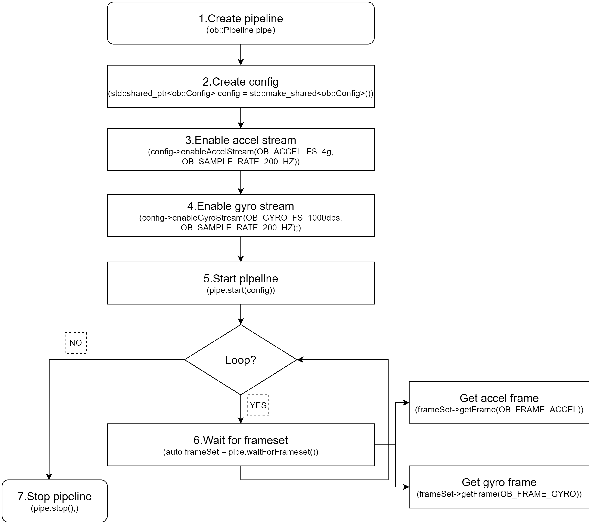

# Create Device

There are multiple ways to obtain a Device.
If your use case involves multiple devices, it is recommended to use Method 1, Method 2, or Method 3.
If you are working with a single device, Method 4 is recommended for accessing the Device.

```c++
// Create a Context
ob::Context ctx;

// Method 1
// Enumerate all connected devices through the Context.
std::shared_ptr<DeviceList> devices = ctx.queryDeviceList();
// Get the device at index 0.
auto device = devices->getDevice(0);

// Method 2
// Enumerate all connected devices through the Context.
std::shared_ptr<DeviceList> devices = ctx.queryDeviceList();
// Get the device by serial number.
auto device = devices->getDeviceBySN("AE4M73D0040");

// Method 3
// Enumerate all connected devices through the Context.
std::shared_ptr<DeviceList> devices = ctx.queryDeviceList();
// Get the device by uid.
auto device = devices->getDeviceByUid("NDSG3958LKHY45");

// Method 4
ob::Pipeline pipe;
// Get the device by pipeline.
auto device = pipe.getDevice();
```

# Create Pipeline

There are two ways to create a Pipeline.
If your use case involves multiple devices, use Method 2, which creates a separate Pipeline for each Device.
For single-device scenarios, Method 1 is the most straightforward way to create a Pipeline.

```c++
//Method 1
ob::Pipeline pipe;

//Method 2，create with device
auto pipe = std::make_shared<ob::Pipeline>(device);
```

# Obtain the Sensor List

Obtain the sensor list from the Device, and then obtain the supported sensor types from the sensor list.

```c++
// 1.Create a pipeline with default device.
ob::Pipeline pipe;

// 2.Get the device from pipeline.
std::shared_ptr<ob::Device> device = pipe.getDevice();

// 3.Get the sensor list from device.
std::shared_ptr<ob::SensorList> sensorList = device->getSensorList();

// 4.Query all supported sensor type
for(uint32_t index = 0; index < sensorList->getCount(); index++) {
    OBSensorType sensorType = sensorList->getSensorType(index);
    std::cout << "Supported Sensor type: \n" << sensorType;
}
```

# Obtain LiDAR Data Streams

The LiDAR point cloud data stream includes formats such as `OB_FORMAT_LIDAR_SCAN`, `OB_FORMAT_LIDAR_POINT`, and `OB_FORMAT_LIDAR_SPHERE_POINT`. Among these, `OB_FORMAT_LIDAR_SCAN` is designed for single-line LiDAR systems, while `OB_FORMAT_LIDAR_POINT` and `OB_FORMAT_LIDAR_SPHERE_POINT` are intended for multi-line LiDAR systems. The key distinction between the latter two is that `OB_FORMAT_LIDAR_POINT` outputs data in Cartesian coordinates (rectangular coordinates), whereas `OB_FORMAT_LIDAR_SPHERE_POINT` outputs data in spherical coordinates.

The difference between Blocking Polling Mode and Asynchronous Callback Mode: In Blocking Polling Mode after frame aggregation in the pipeline, the frame is inserted into the queue, and the application obtain frame data from the queue by calling waitForFrameset. In Asynchronous Callback Mode, after frame aggregation, the frame is directly passed back to the application via a callback. The advantage of Asynchronous Callback Mode is that it is more real-time, but in the callback function, the application layer should avoid time-consuming tasks and should release the frame as soon as possible.

##  Blocking Polling Mode

Workflow Diagram:


Key API Descriptions:

```c++
// 1.Create a pipeline with default device.
ob::Pipeline pipe;

// 2.Create config.
std::shared_ptr<ob::Config> config = std::make_shared<ob::Config>();

// 3.Enable LiDAR stream. You can modify the parameters based on your usage requirements
config->enableLiDARStream(OB_LIDAR_SCAN_20HZ, OB_FORMAT_LIDAR_SPHERE_POINT);

// 4.Start the pipeline with config.
pipe.start(config);

while(true) {
    // 5.Wait for up to 100ms for a frameset in blocking mode.
    auto frameSet = pipe.waitForFrameset(100);
    if(frameSet == nullptr) {
        continue;
    }
    
    // Get LiDAR point cloud frame
    auto frame = frameset->getFrame(OB_FRAME_LIDAR_POINTS);
    if(!frame) {
        std::cout << "No LiDAR frame found!" << std::endl;
        continue;
    }

    // Save point cloud data to ply file
    if(!ob::PointCloudHelper::savePointcloudToPly("LiDARPoints.ply", frame, false, false, 50)) {
        std::cout << "Failed to save LiDARPoints.ply" << std::endl;
        continue;
    }

    std::cout << "LiDARPoints.ply Saved" << std::endl;
}

// 6.Stop the pipeline
pipe.stop();
```

## Asynchronous Callback Mode

Workflow Diagram:


Key API Descriptions:

```c++
// 1.Create a pipeline with default device.
ob::Pipeline pipe;

// 2.Create config.
std::shared_ptr<ob::Config> config = std::make_shared<ob::Config>();

// 3.Enable LiDAR stream. You can modify the parameters based on your usage requirements
config->enableLiDARStream(OB_LIDAR_SCAN_20HZ, OB_FORMAT_LIDAR_SPHERE_POINT);

// 4.Start the pipeline with config and callback.
pipe.start(config, [&](std::shared_ptr<ob::FrameSet> frameSet) {
    // Get LiDAR point cloud frame
    auto frame = frameset->getFrame(OB_FRAME_LIDAR_POINTS);
    if(!frame) {
        std::cout << "No LiDAR frame found!" << std::endl;
    }else{
        // Process LiDAR point cloud frame
    }
});

// 5.Stop the pipeline
pipe.stop();
```

# Obtain IMU Data Streams

##  Blocking Polling Mode

Workflow Diagram:



Key API Descriptions:

```c++
// 1.Create a pipeline with default device.
ob::Pipeline pipe;

// 2.Create config.
std::shared_ptr<ob::Config> config = std::make_shared<ob::Config>();

// 3.Enable Accel stream, You can modify the parameters based on your usage requirements
config->enableAccelStream(OB_ACCEL_FS_4g, OB_SAMPLE_RATE_200_HZ);

// 4.Enable Gyro stream, You can modify the parameters based on your usage requirements
config->enableGyroStream(OB_GYRO_FS_1000dps, OB_SAMPLE_RATE_200_HZ);

// 5.Start the pipeline with config.
pipe.start(config);

while(true) {
    // 6.Wait for up to 100ms for a frameset in blocking mode.
    auto frameSet = pipe.waitForFrameset();
    if(frameSet == nullptr) {
        continue;
    }
    auto accelFrameRaw    = frameSet->getFrame(OB_FRAME_ACCEL);
    auto gyroFrameRaw    = frameSet->getFrame(OB_FRAME_GYRO);
}

// 7.Stop the pipeline
pipe.stop();
```

## Asynchronous Callback Mode

Workflow Diagram:


Key API Descriptions:

```c++
// 1.Create a pipeline with default device.
ob::Pipeline pipe;

// 2.Create config.
std::shared_ptr<ob::Config> config = std::make_shared<ob::Config>();

// 3.Enable Accel stream, You can modify the parameters based on your usage requirements
config->enableAccelStream(OB_ACCEL_FS_4g, OB_SAMPLE_RATE_200_HZ);

// 4.Enable Gyro stream, You can modify the parameters based on your usage requirements
config->enableGyroStream(OB_GYRO_FS_1000dps, OB_SAMPLE_RATE_200_HZ);

// 5.Start the pipeline with config and callback.
pipe.start(config, [&](std::shared_ptr<ob::FrameSet> frameSet) {
    if(frameSet != nullptr) {
        auto accelFrameRaw    = frameSet->getFrame(OB_FRAME_ACCEL);
        auto gyroFrameRaw    = frameSet->getFrame(OB_FRAME_GYRO);
    }
});

// 6.Stop the pipeline
pipe.stop();
```

# Frame Aggregate

The frame aggregation feature is used to configure the output mode of frame data streams. This feature can be set through the interface provided by ob::Config.
There are four types of frame aggregation modes.

Key API Descriptions:

```c++
// Set through the interface provided by ob::Config.
void setFrameAggregateOutputMode(OBFrameAggregateOutputMode mode);

// The types of modes included in frame aggregation are as follows.
typedef enum {
    /**
     * @brief Only FrameSet that contains all types of data frames will be output
     */
    OB_FRAME_AGGREGATE_OUTPUT_ALL_TYPE_FRAME_REQUIRE = 0,
    /**
     * @brief Color Frame Require output mode
     * @brief Suitable for Color using H264, H265 and other inter-frame encoding format open stream
     * @attention In this mode, the user may return null when getting a non-Color type data frame from the acquired FrameSet
     */
    OB_FRAME_AGGREGATE_OUTPUT_COLOR_FRAME_REQUIRE,
    /**
     * @brief FrameSet for any case will be output
     * @attention In this mode, the user may return null when getting the specified type of data frame from the acquired FrameSet
     */
    OB_FRAME_AGGREGATE_OUTPUT_ANY_SITUATION,
    /**
     * @brief Disable Frame Aggreate
     * @attention In this mode, All types of data frames will output independently.
     */
    OB_FRAME_AGGREGATE_OUTPUT_DISABLE,
} OB_FRAME_AGGREGATE_OUTPUT_MODE,OBFrameAggregateOutputMode,ob_frame_aggregate_output_mode
```

For example, if LiDAR and IMU streams are all enabled and the frame aggregation mode is set to OB_FRAME_AGGREGATE_OUTPUT_ALL_TYPE_FRAME_REQUIRE, it means that the returned FrameSet will contain non-null frame data for all two streams.
Sample code is shown below:

```c++
// 1.Create a pipeline with default device.
ob::Pipeline pipe;
// 2.Create config.
std::shared_ptr<ob::Config> config = std::make_shared<ob::Config>();
// 3.Enable LiDAR stream. You can modify the parameters based on your usage requirements
config->enableLiDARStream(OB_LIDAR_SCAN_20HZ, OB_FORMAT_LIDAR_SPHERE_POINT);
// 4.Enable Accel stream. You can modify the parameters based on your usage requirements
config->enableAccelStream();
// 5.Enable Gyro stream. You can modify the parameters based on your usage requirements
config->enableGyroStream();

// 6.Start the pipeline with config.
pipe.start(config);

while(true) {
    // 7.Wait for up to 100ms for a frameset in blocking mode.
    auto frameSet = pipe.waitForFrameset(100);
    if(frameSet == nullptr) {
        continue;
    }
  
    // 8.Push the frameset to the Align Filter to align the frames.
    auto alignFrameSet = frame->as<ob::FrameSet>();
    if(frameSet != nullptr) {
       // Get all frame.
        auto lidarFrame = frameset->getFrame(OB_FRAME_LIDAR_POINTS);
        auto accelFrame = frameset->getFrame(OB_FRAME_ACCEL);
        auto gyroFrame  = frameset->getFrame(OB_FRAME_GYRO);
    }
}

// 9.Stop the pipeline.
pipe.stop();
```

Workflow Diagram:


# Recording and Playback


## Recording

Data stream recording is primarily implemented using ob::RecordDevice. Taking LiDAR stream recording as an example.
If you want to record multiple streams at the same time, you can enable them simultaneously.

Key API Description：
```c++
// Initialize recording device with output file,and start record
auto recordDevice = std::make_shared<ob::RecordDevice>(device, filePath);

// pause
recorder->pause();

// resume
recorder->resume();
```

Workflow Diagram:


## Playback

Data stream playback is primarily implemented using ob::PlaybackDevice.
For a detailed playback implementation, refer to the SDK sample ob_device_playback.

Key API Description：

```c++
// Initialize playback device with input file
std::shared_ptr<ob::PlaybackDevice> playback = std::make_shared<ob::PlaybackDevice>(filePath);

//Set playback speed, Setting it to 2 indicates playback at twice the speed.
playback->setPlaybackRate(2);  

//The duration of the playback device, in milliseconds.
playback->getDuration(); 

// Get the current playback position
playback->getPosition();

//Set the starting point for playback, which must be within the total duration of the recording.
playback->seek(timestamp) 
```

Workflow Diagram:


Key API Description：

```c++
// Get valid .bag
std::string   filePath = "./LiDAR.bag";

// 1.Create a playback device with a Rosbag file
std::shared_ptr<ob::PlaybackDevice> playback = std::make_shared<ob::PlaybackDevice>(filePath);
// 2.Create a pipeline with the playback device
std::shared_ptr<ob::Pipeline> pipe = std::make_shared<ob::Pipeline>(playback);
// 3.Enable all recording streams from the playback device
std::shared_ptr<ob::Config> config = std::make_shared<ob::Config>();

// 4.Set playback status change callback, when the playback stops, start the pipeline again with the same config
bool playbackStop = false;
playback->setPlaybackStatusChangeCallback([&](OBPlaybackStatus status) {
    if(status == OB_PLAYBACK_STOPPED) {
        playbackStop = true;
      }
});

// 5.Get the list of playback sensors
auto sensorList = playback->getSensorList();
// 6.enable the data streams for playback
for(uint32_t i = 0; i < sensorList->getCount(); i++) {
    auto sensorType = sensorList->getSensorType(i);
    config->enableStream(sensorType);
}

// 7.Start the pipeline with the config
pipe->start(config);

while(!playbackStop) {
    // 8.Wait for up to 1000ms for a frameset in blocking mode.
    auto frameSet = pipe->waitForFrames(1000);
    if(frameSet == nullptr) {
        continue;
    }
    // Get LiDAR frame
 	auto frame = frameset->getFrame(OB_FRAME_LIDAR_POINTS);
}

// 9.Stop the pipeline.
pipe->stop();
```

# Device Disconnection and Reconnection

The SDK provides a device connection change listener, which helps users handle exceptions when a device is disconnected and enables recovery the device is reconnected.

```c++
// 1.create context
ob::Context ctx;

// 2.register device callback
ctx.setDeviceChangedCallback([](std::shared_ptr<ob::DeviceList> removedList, std::shared_ptr<ob::DeviceList> deviceList) {
        //Connected devices
        printDeviceList("added", deviceList);
        //Disconnected devices
        printDeviceList("removed", removedList);
    });
```

In the setDeviceChangedCallback callback of ob::Context,
removedList indicates that the SDK has detected a device disconnection (offline),while deviceList indicates that the SDK has detected a device connection (online).

# Commonly Used Interfaces

## Obtain the Serial Number

```c++
auto         device = pipe.getDevice();
auto deviceInfo = device->getDeviceInfo();
std::string serialNumber = deviceInfo->serialNumber();
```

## Obtain LiDAR StreamProfile

- Obtain StreamProfile via Pipeline

```c++
ob::Pipeline pipe;
// Obtain the profile list of the LiDAR.
auto lidarProfiles = pipe.getStreamProfileList(OB_SENSOR_LIDAR);
```

- Obtain StreamProfile via Frame

```c++
auto frameSet = pipe->waitForFrameset(100);

// Get the LiDAR stream profile
auto frame = frameset->getFrame(OB_FRAME_LIDAR_POINTS);
auto profile = frame->getStreamProfile();

auto lidarProfile = profile->as<ob::LiDARStreamProfile>();
```

## Obtain IMU StreamProfile

- Obtain IMU StreamProfile from IMU frame

```c++
auto frameSet = pipe.waitForFrameset();

// Get the accel stream profile
auto accelFrameRaw    = frameSet->getFrame(OB_FRAME_ACCEL);
auto accelStreamProfile = accelFrameRaw->getStreamProfile();
auto accelProfile = accelStreamProfile->as<ob::AccelStreamProfile>();

// Get the gyro stream profile
auto gyroFrameRaw    = frameSet->getFrame(OB_FRAME_GYRO);
auto gyroStreamProfile = gyroFrameRaw->getStreamProfile();
auto gyroProfile = gyroStreamProfile->as<ob::GyroStreamProfile>();
```