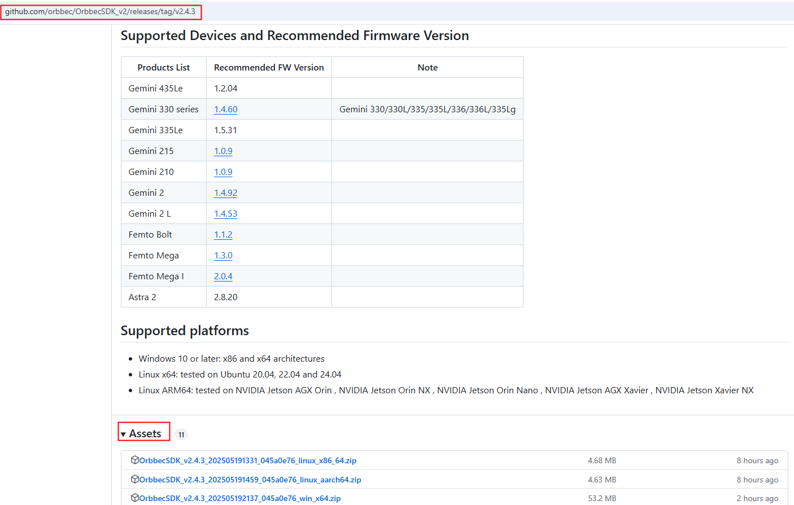
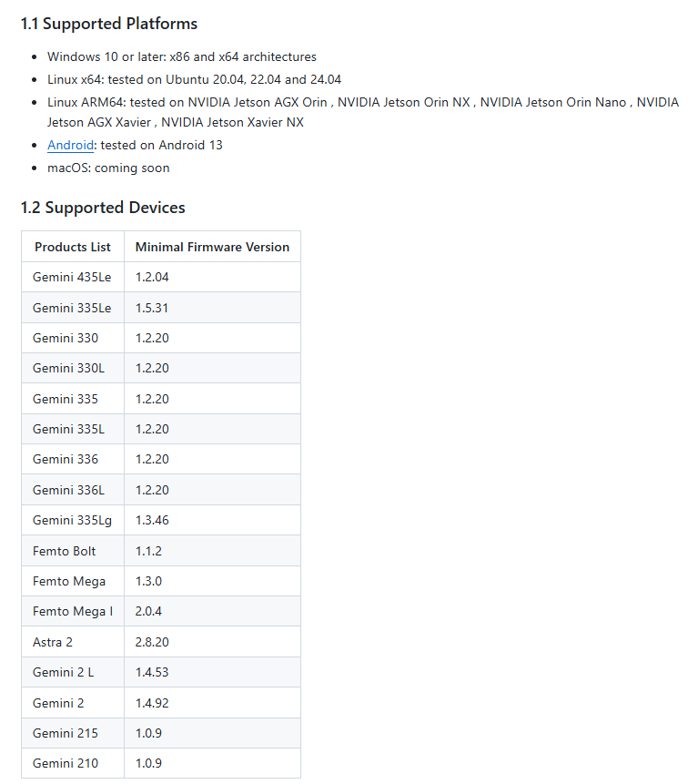
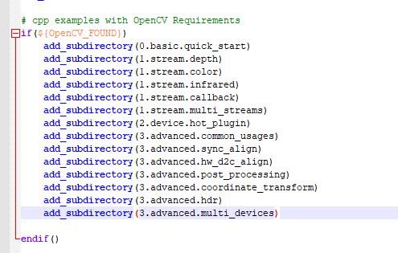

# Environment Setup

## SDK Download

Visit the official Orbbec GitHub repository [OrbbecSDK_v2 releases](https://github.com/orbbec/OrbbecSDK_v2/releases) to download a precompiled version of the SDK, You can also download the [source code](https://github.com/orbbec/OrbbecSDK_v2), and build it. For build instructions, refer to: [build orbbec sdk](https://github.com/orbbec/OrbbecSDK_v2/blob/main/docs/tutorial/building_orbbec_sdk.md).

The image below shows an example using version v2.4.3. Go to the [OrbbecSDK_v2 GitHub release page](https://github.com/orbbec/OrbbecSDK_v2/releases/tag/v2.4.3) and download the precompiled SDK and OrbbecViewer tool from the Assets section.

## Device Support Verification

Before using the SDK, be sure to check the list of supported devices to verify that your device is compatible and ensure proper functionality.

To check if your device is supported, visit [support device](https://github.com/orbbec/OrbbecSDK_v2?tab=readme-ov-file#12-supported-devices).
This page lists the supported platforms and device.

## Development Environment Configuration

Use Windows as an example to set up your development environment. Visual Studio 2019 is recommended as the IDE. Make sure that CMake, Visual Studio 2017 or later, GCC, OpenCV, and other necessary dependencies are properly installed.

To ensure the SDK samples render and display correctly, OpenCV must be installed. Otherwise, This samples may fail to run or display incorrectly.

You can download OpenCV from:[https://opencv.org/releases/](https://opencv.org/releases/).

