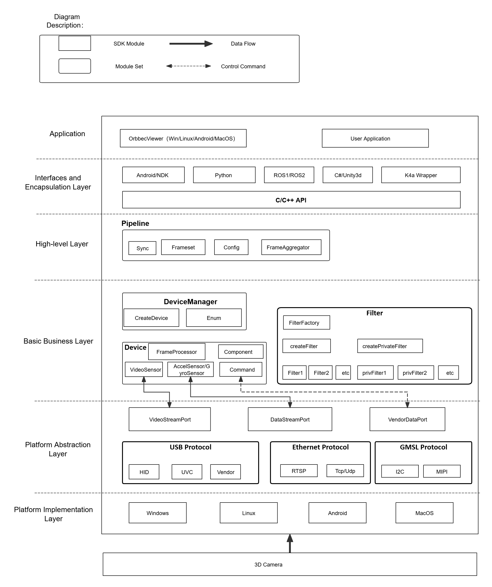
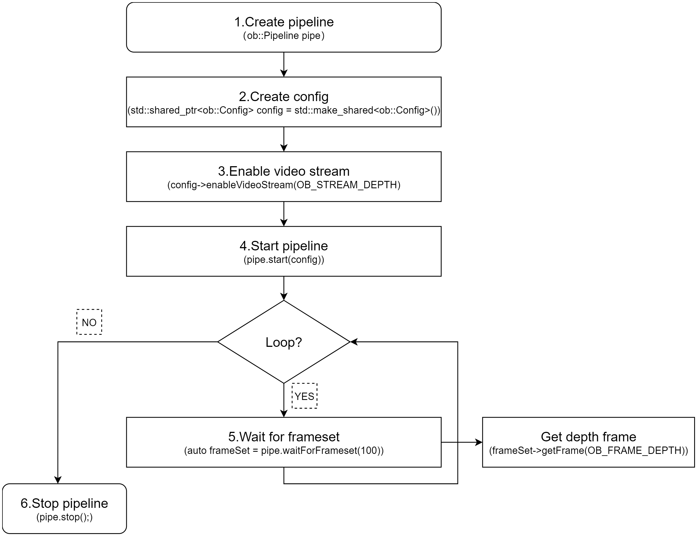

# SDK  Overview

## Terms

|  ID  |  Name  |  Explain  |
| --- | --- | --- |
|  1  | LiDAR        | Light Detection and Ranging - uses laser pulses to measure distance and create 3D point clouds |
| 2    | Firmware     | Firmware of LiDAR device                                     |
| 3    | Point Cloud  | A set of data points in space representing the 3D shape of scanned environment |
| 4    | Scan Rate    | Frequency at which LiDAR completes full scans                |
| 5    | Azimuth      | Horizontal angle of laser beam direction                     |
| 6    | Zenith       | Zenith angle - the angle between the laser beam and the vertical direction |
| 7    | Reflectivity | The measure of a surface's ability to reflect laser pulses, affecting the intensity of returned signals |

## Orbbec SDK v2 Architecture Overview

- Application

OrbbecViewer, Sample, and User Application Implementation.

- Interfaces and Encapsulation Layer

OrbbecSDK Interface Encapsulation and Wrapper Encapsulation.

- High-level Layer

HighLevel encapsulates the core business components and provides interfaces to the outside using a pipeline.

- Basic business layer

The realization of the core business logic framework.

- Platform abstraction layer

Cross-platform components abstract operating system differences and provide a unified access interface.

- Platform implementation layer 

The driver implementation of each platform.

## SDK Concept Overview

- Context
    

Context which provides a set of settings includes settings such as device state change callbacks, log levels, and more. The Context can access multiple devices.

- Device
    

One actual hardware device corresponds to one Device object, which is used to obtain relevant information of the device and control its attributes.

- Pipeline
    

The HighLevel corresponding object encapsulates the interface for quick access to the SDK. It has simple functions that allow users to quickly get started and use the SDK.

- Config
    

Provides configuration for enabling data streams, alignment modes, and frame aggregation modes,  It is used to control the behavior of the data output. 

- StreamProfile 
    

Stream configuration that defines parameters such as resolution, frame rate, and encoding format, It also provides management of camera parameters.

- Frame
    

Represents a frame of data in the Stream, and also contains relevant information about that frame of data, such as timestamp, type, etc.

- Filter
    

It mainly refers to some algorithmic processing modules for the composite stream FrameSet, such as point cloud algorithm processing.

- Record
    

Recording functionality that captures data streams and saves them as files for later analysis or playback.

- Playback
    

Playback functionality that plays recorded files and supports control over playback speed and other related parameters.

## SDK Programming Model

- Standard Flowchart:

The standard flowchart demonstrates how to create a device from the device list, set and get parameters, and apply post-processing filters.

- Flowchart using default configuration (stream acquisition based on the default settings in OrbbecSDKConfig.xml):

