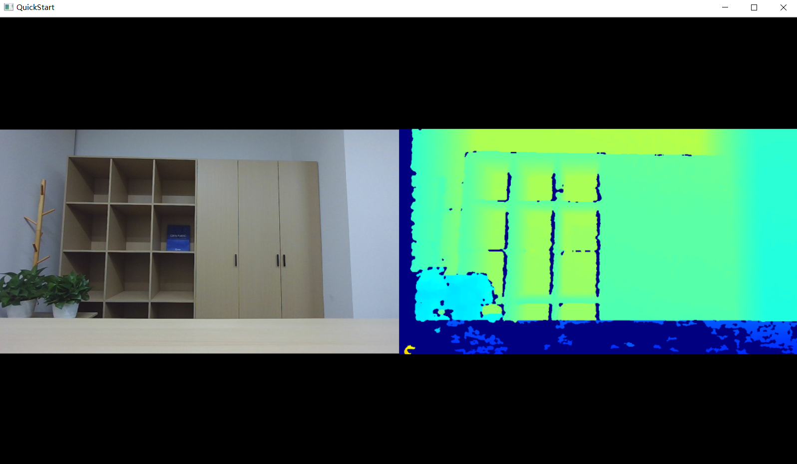

# Quick Start on Windows Platform

This section demonstrates how to quickly start and build the SDK on the Windows platform. The SDK version used here is v2.4.3. First, extract the downloaded Orbbec SDK package, then navigate to the examples directory in the extracted folder and use CMake to compile the project.

Click the Configure button, and the following dialog will appear:

Click Finish, then click Generate, as shown below:

Open the sample project (orbbec_sdk_examples.sln) using Visual Studio 2019.

Use the ob_quick_start sample as an introductory example to understand and use the SDK API. First, build the ob_quick_start sample and run it to start capturing data streams.

- Note:
 Make sure to copy the required SDK dynamic libraries and OpenCV DLLs to the directory where ob_quick_start.exe is located. The OpenCV libraries are essential for rendering the sample views.

The ob_quick_start sample captures and displays data streams as shown below:

# Quick Start on Linux Platform

*   Build Requirements：
    
    * Operating System：Ubuntu 18.04 or later
        
    * Compiler：GCC，>=7.5
        
    * CMake v3.15 or later
        
    * OpenCV：Version 3.4.0 is recommended
        
    * Visual Studio Code：Recommended IDE for building and debugging
        

- First, download the Linux version of the Orbbec SDK package and extract it.
Then, navigate to the shared directory and install the udev script.
This script ensures that the correct libusb driver is loaded. 
After installing the udev script, you can run the samples without sudo privileges.

The installation process is shown below:
    

- Run the build_examples.sh script to compile the examples.
    

- Navigate to the bin directory and run the ob_quick_start sample to capture data streams.
    

