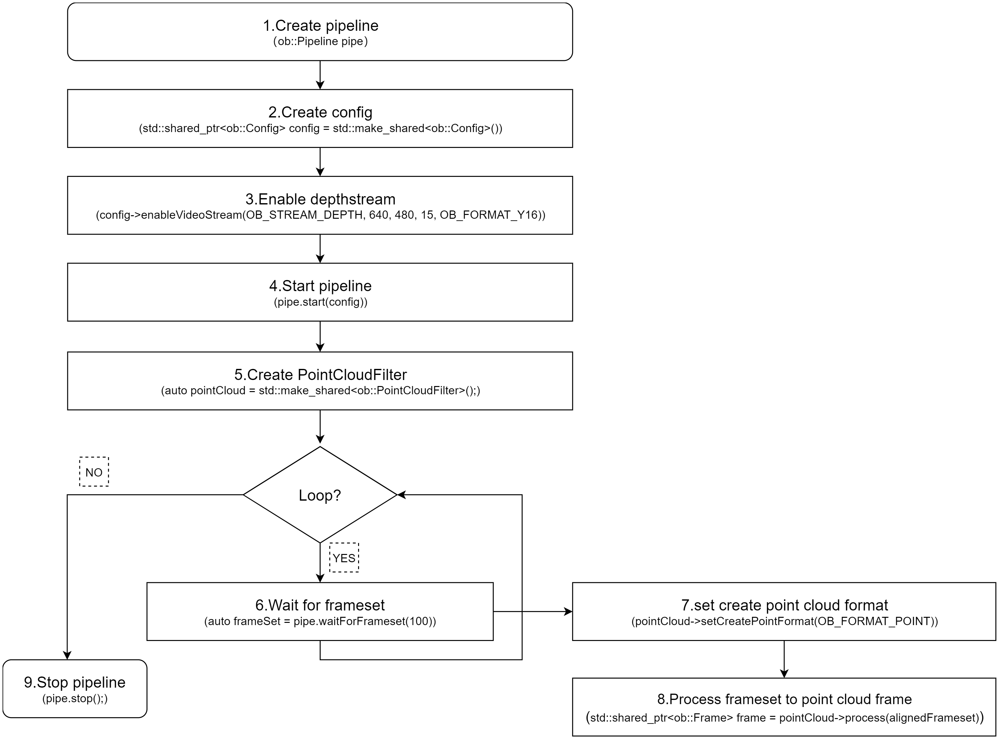
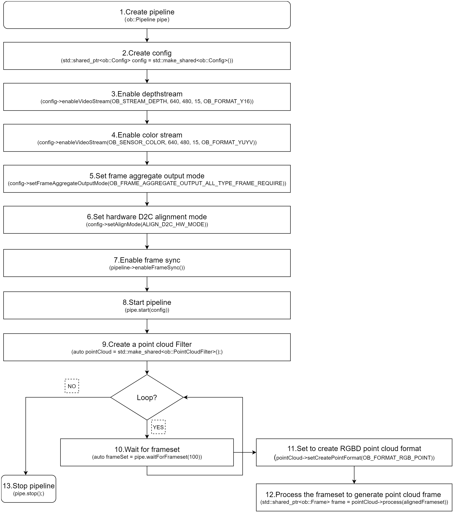
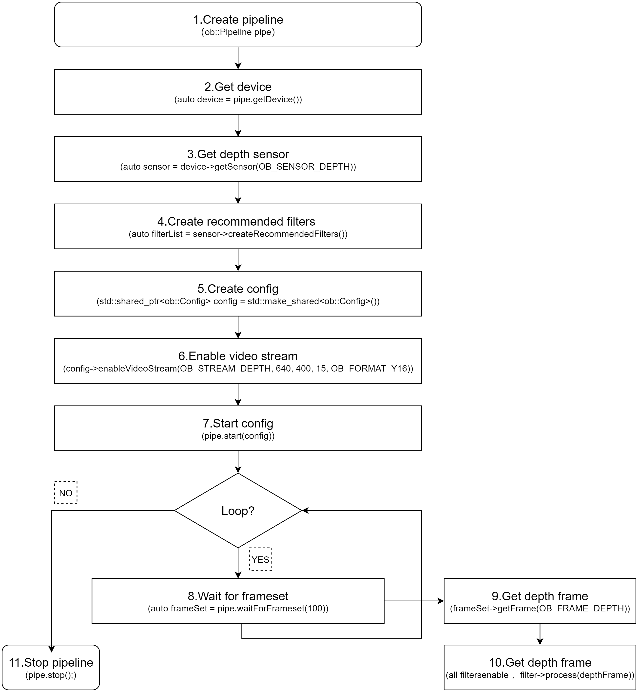
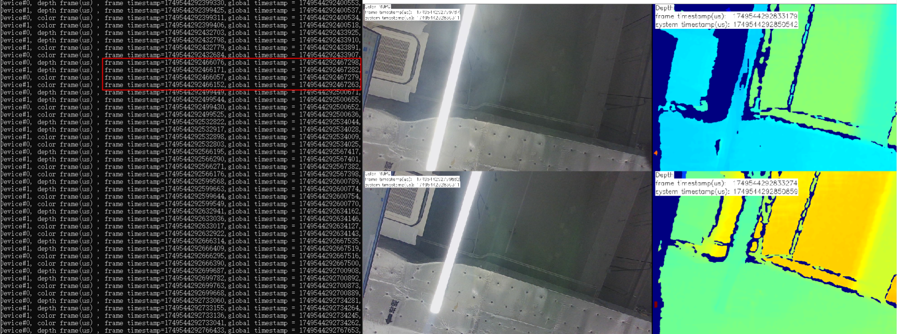

# Create Device

There are multiple ways to obtain a Device.
If your use case involves multiple devices, it is recommended to use Method 1, Method 2, or Method 3.
If you are working with a single device, Method 4 is recommended for accessing the Device.

```c++
// Create a Context
ob::Context ctx;

// Method 1
// Enumerate all connected devices through the Context.
std::shared_ptr<DeviceList> devices = ctx.queryDeviceList();
// Get the device at index 0.
auto device  = devices->getDevice(0);

// Method 2
// Enumerate all connected devices through the Context.
std::shared_ptr<DeviceList> devices = ctx.queryDeviceList();
// Get the device by serial number.
auto device = devices->getDeviceBySN("AE4M73D0040");

// Method 3
// Enumerate all connected devices through the Context.
std::shared_ptr<DeviceList> devices = ctx.queryDeviceList();
// Get the device by uid.
auto device = devices->getDeviceByUid("NDSG3958LKHY45");

// Method 4
ob::Pipeline pipe;
// Get the device by pipeline.
auto         device = pipe.getDevice();
```

# Create Pipeline

There are two ways to create a Pipeline.
If your use case involves multiple devices, use Method 2, which creates a separate Pipeline for each Device.
For single-device scenarios, Method 1 is the most straightforward way to create a Pipeline.

```c++
//Method 1
ob::Pipeline pipe;

//Method 2，create with device
auto pipe = std::make_shared<ob::Pipeline>(device);
```

# Obtain the Sensor List

Obtain the sensor list from the Device, and then obtain the supported sensor types from the sensor list.

```c++
// 1.Create a pipeline with default device.
ob::Pipeline pipe;

// 2.Get the device from pipeline.
std::shared_ptr<ob::Device> device = pipe.getDevice();

// 3.Get the sensor list from device.
std::shared_ptr<ob::SensorList> sensorList = device->getSensorList();

// 4.Create a config for pipeline.
std::shared_ptr<ob::Config> config = std::make_shared<ob::Config>();

// 5.Query all supported sensor type
for(uint32_t index = 0; index < sensorList->getCount(); index++) {
    OBSensorType sensorType = sensorList->getSensorType(index);
    std::cout << "Supported Sensor type: \n" << sensorType;
}
```

# Obtain Video Data Streams

Common data streams include Depth, Left IR, Right IR, and Color.
Using the Depth stream as an example, the resolution is set to 640x400, the frame rate to 15 fps, and the output format to Y16.
The handling of infrared and color streams follows a similar process.

The difference between Blocking Polling Mode and Asynchronous Callback Mode: In Blocking Polling Mode after frame aggregation in the pipeline, the frame is inserted into the queue, and the application obtain frame data from the queue by calling waitForFrameset. In Asynchronous Callback Mode, after frame aggregation, the frame is directly passed back to the application via a callback. The advantage of Asynchronous Callback Mode is that it is more real-time, but in the callback function, the application layer should avoid time-consuming tasks and should release the frame as soon as possible.

##  Blocking Polling Mode

Workflow Diagram:


Key API Descriptions:

```c++
// 1.Create a pipeline with default device.
ob::Pipeline pipe;

// 2.Create config.
std::shared_ptr<ob::Config> config = std::make_shared<ob::Config>();

// 3.Enable video stream. You can modify the parameters based on your usage requirements
config->enableVideoStream(OB_STREAM_DEPTH, 640, 400, 15, OB_FORMAT_Y16);

// 4.Start the pipeline with config.
pipe.start(config);

while(true) {
    // 5.Wait for up to 100ms for a frameset in blocking mode.
    auto frameSet = pipe.waitForFrameset(100);
    if(frameSet == nullptr) {
        continue;
    }
  
    // Get the depth frame.
    auto depthFrameRaw = frameSet->getFrame(OB_FRAME_DEPTH);
    if(depthFrameRaw) {
      // Get the depth Frame form depthFrame,process depth data.
      auto depthFrame = depthFrameRaw->as<ob::DepthFrame>();
      uint32_t        width  = depthFrame->getWidth();
      uint32_t        height = depthFrame->getHeight();
      const uint16_t *data   = reinterpret_cast<const uint16_t *>(depthFrame->getData());
    }
}

// 6.Stop the pipeline
pipe.stop();
```

## Asynchronous Callback Mode

Workflow Diagram:


Key API Descriptions:

```c++
// 1.Create a pipeline with default device.
ob::Pipeline pipe;

// 2.Create config.
std::shared_ptr<ob::Config> config = std::make_shared<ob::Config>();

// 3.Enable video stream. You can modify the parameters based on your usage requirements
config->enableVideoStream(OB_STREAM_DEPTH, 640, 400, 15, OB_FORMAT_Y16);

// 4.Start the pipeline with config and callback.
pipe.start(config, [&](std::shared_ptr<ob::FrameSet> frameSet) {
    // Get the depth frame.
    auto depthFrameRaw = frameSet->getFrame(OB_FRAME_DEPTH);
    if(depthFrameRaw) {
      // Get the depth Frame form depthFrame,process depth data.
      auto depthFrame = depthFrameRaw->as<ob::DepthFrame>();
      uint32_t        width  = depthFrame->getWidth();
      uint32_t        height = depthFrame->getHeight();
      const uint16_t *data   = reinterpret_cast<const uint16_t *>(depthFrame->getData());
    }
});

// 5.Stop the pipeline
pipe.stop();
```

# Obtain Imu Data Streams

##  Blocking Polling Mode

Workflow Diagram:


Key API Descriptions:

```c++
// 1.Create a pipeline with default device.
ob::Pipeline pipe;

// 2.Create config.
std::shared_ptr<ob::Config> config = std::make_shared<ob::Config>();

// 3.Enable Accel stream, You can modify the parameters based on your usage requirements
config->enableAccelStream(OB_ACCEL_FS_4g, OB_SAMPLE_RATE_200_HZ);

// 4.Enable Gyro stream, You can modify the parameters based on your usage requirements
config->enableGyroStream(OB_GYRO_FS_1000dps, OB_SAMPLE_RATE_200_HZ);

// 5.Start the pipeline with config.
pipe.start(config);

while(true) {
    // 6.Wait for up to 100ms for a frameset in blocking mode.
    auto frameSet = pipe.waitForFrameset();
    if(frameSet == nullptr) {
        continue;
    }
    auto accelFrameRaw    = frameSet->getFrame(OB_FRAME_ACCEL);
    auto gyroFrameRaw    = frameSet->getFrame(OB_FRAME_GYRO);
}

// 7.Stop the pipeline
pipe.stop();
```

## Asynchronous Callback Mode

Workflow Diagram:


Key API Descriptions:

```c++
// 1.Create a pipeline with default device.
ob::Pipeline pipe;

// 2.Create config.
std::shared_ptr<ob::Config> config = std::make_shared<ob::Config>();

// 3.Enable Accel stream, You can modify the parameters based on your usage requirements
config->enableAccelStream(OB_ACCEL_FS_4g, OB_SAMPLE_RATE_200_HZ);

// 4.Enable Gyro stream, You can modify the parameters based on your usage requirements
config->enableGyroStream(OB_GYRO_FS_1000dps, OB_SAMPLE_RATE_200_HZ);

// 5.Start the pipeline with config and callback.
pipe.start(config, [&](std::shared_ptr<ob::FrameSet> frameSet) {
    if(frameSet != nullptr) {
        auto accelFrameRaw    = frameSet->getFrame(OB_FRAME_ACCEL);
        auto gyroFrameRaw    = frameSet->getFrame(OB_FRAME_GYRO);
    }
});

// 6.Stop the pipeline
pipe.stop();
```

# Frame Aggregate

The frame aggregation feature is used to configure the output mode of frame data streams. This feature can be set through the interface provided by ob::Config.
There are four types of frame aggregation modes.

Key API Descriptions:

```c++
// Set through the interface provided by ob::Config.
void setFrameAggregateOutputMode(OBFrameAggregateOutputMode mode);

// The types of modes included in frame aggregation are as follows.
typedef enum {
    /**
     * @brief Only FrameSet that contains all types of data frames will be output
     */
    OB_FRAME_AGGREGATE_OUTPUT_ALL_TYPE_FRAME_REQUIRE = 0,
    /**
     * @brief Color Frame Require output mode
     * @brief Suitable for Color using H264, H265 and other inter-frame encoding format open stream
     * @attention In this mode, the user may return null when getting a non-Color type data frame from the acquired FrameSet
     */
    OB_FRAME_AGGREGATE_OUTPUT_COLOR_FRAME_REQUIRE,
    /**
     * @brief FrameSet for any case will be output
     * @attention In this mode, the user may return null when getting the specified type of data frame from the acquired FrameSet
     */
    OB_FRAME_AGGREGATE_OUTPUT_ANY_SITUATION,
    /**
     * @brief Disable Frame Aggreate
     * @attention In this mode, All types of data frames will output independently.
     */
    OB_FRAME_AGGREGATE_OUTPUT_DISABLE,
} OB_FRAME_AGGREGATE_OUTPUT_MODE,OBFrameAggregateOutputMode,ob_frame_aggregate_output_mode
```


For example, if Depth, Color, Left IR, and Right IR streams are all enabled and the frame aggregation mode is set to OB_FRAME_AGGREGATE_OUTPUT_ALL_TYPE_FRAME_REQUIRE, it means that the returned FrameSet will contain non-null frame data for all four streams.
Sample code is shown below:

```c++
// 1.Create a pipeline with default device.
ob::Pipeline pipe;
// 2.Create config.
std::shared_ptr<ob::Config> config = std::make_shared<ob::Config>();
// 3.Enable depth video stream. You can modify the parameters based on your usage requirements
config->enableVideoStream(OB_STREAM_DEPTH, 640, 480, 15, OB_FORMAT_Y16);
// 4.Enable color video stream. You can modify the parameters based on your usage requirements
config->enableVideoStream(OB_STREAM_COLOR, 640, 480, 15, OB_FORMAT_YUYV);
// 5.Enable left ir video stream. You can modify the parameters based on your usage requirements
config->enableVideoStream(OB_STREAM_IR_LEFT, 640, 480, 15, OB_FORMAT_Y8);
// 6.Enable right ir video stream. You can modify the parameters based on your usage requirements
config->enableVideoStream(OB_STREAM_IR_RIGHT, 640, 480, 15, OB_FORMAT_Y8);
// 7.Set the frame aggregate output mode to ensure all types of frames are included in the output frameset
config->setFrameAggregateOutputMode(OB_FRAME_AGGREGATE_OUTPUT_ALL_TYPE_FRAME_REQUIRE);

// 8.Start the pipeline with config.
pipe.start(config);

while(true) {
    // 9.Wait for up to 100ms for a frameset in blocking mode.
    auto frameSet = pipe.waitForFrameset(100);
    if(frameSet == nullptr) {
        continue;
    }
  
    // 10.Push the frameset to the Align Filter to align the frames.
    auto alignFrameSet = frame->as<ob::FrameSet>();
    if(frameSet != nullptr) {
       // Get all frame.
       auto depthFrameRaw = frameSet->getFrame(OB_FRAME_DEPTH);
       auto colorFrameRaw = frameSet->getFrame(OB_FRAME_COLOR);
       auto leftIrFrameRaw = frameSet->getFrame(OB_FRAME_IR_LEFT);
       auto RightIrFrameRaw = frameSet->getFrame(OB_FRAME_RIGHT_LEFT);
    }
}

// 11.Stop the pipeline.
pipe.stop();
```

Workflow Diagram:


# D2C

D2C requires both Depth and Color streams to be enabled. The following section introduces Hardware D2C and Software D2C.

## Hardware D2C


The key interface for hardware D2C is setting the D2C mode to hardware via ob::Config, which enables the hardware D2C functionality.

```
config->setAlignMode(ALIGN_D2C_HW_MODE)
```


Key API Descriptions:

```c++
// 1.Create a pipeline with default device.
ob::Pipeline pipe;

// 2.Create config.
std::shared_ptr<ob::Config> config = std::make_shared<ob::Config>();

// 3.Enable depth video stream. You can modify the parameters based on your usage requirements
config->enableVideoStream(OB_STREAM_DEPTH, 640, 480, 15, OB_FORMAT_Y16);

// 4.Enable color video stream. You can modify the parameters based on your usage requirements
config->enableVideoStream(OB_STREAM_COLOR, 640, 480, 15, OB_FORMAT_YUYV);

// 5.Set hardware D2C alignment mode.
config->setAlignMode(ALIGN_D2C_HW_MODE); 

// 6.Start the pipeline with config.
pipe.start(config);

while(true) {
    // 7.Wait for up to 100ms for a frameset in blocking mode.
    auto frameSet = pipe.waitForFrameset(100);
    if(frameSet == nullptr) {
        continue;
    }
  
    // Get the depth and color frame.
    auto depthFrameRaw = frameSet->getFrame(OB_FRAME_DEPTH);
    auto colorFrameRaw = frameSet->getFrame(OB_FRAME_COLOR);
}

// 8.Stop the pipeline.
pipe.stop();
```

## Software D2C


 Software D2C can be implemented using either synchronous or asynchronous methods. The following introduces the asynchronous approach.Software D2C is implemented using the ob::Align filter,After obtain the FrameSet, you push it to ob::Align via the pushFrame method. The processed D2C FrameSet is then returned asynchronously through a callback.

- Core Interface
```
auto depth2colorAlign = std::make_shared <ob::Align>(OB_STREAM_COLOR);
```

Workflow Diagram:


Key API Descriptions:

```c++
// 1.Create a pipeline with default device.
ob::Pipeline pipe;

// 2.Create config.
std::shared_ptr<ob::Config> config = std::make_shared<ob::Config>();

// 3.Enable depth video stream. You can modify the parameters based on your usage requirements
config->enableVideoStream(OB_STREAM_DEPTH, 640, 480, 15, OB_FORMAT_Y16);

// 4.Enable color video stream. You can modify the parameters based on your usage requirements
config->enableVideoStream(OB_STREAM_COLOR, 640, 480, 15, OB_FORMAT_YUYV);

// 5.Set the frame aggregate output mode to ensure all types of frames are included in the output frameset
config->setFrameAggregateOutputMode(OB_FRAME_AGGREGATE_OUTPUT_ALL_TYPE_FRAME_REQUIRE);

// 6.Start the pipeline with config.
pipe.start(config);

// 7.Create a filter to align depth frame to color frame
auto depth2colorAlign = std::make_shared<ob::Align>(OB_STREAM_COLOR);

// 8.Set the callback function for the Align Filter
depth2colorAlign->setCallBack([&win](std::shared_ptr<ob::Frame> frame) {
    // 11.Processed frames after alignment
    auto alignFrameSet = frame->as<ob::FrameSet>();
    if(alignFrameSet != nullptr) {
       // Get the depth and color frame.
       auto depthFrameRaw = alignFrameSet->getFrame(OB_FRAME_DEPTH);
       auto colorFrameRaw = alignFrameSet->getFrame(OB_FRAME_COLOR);
    }
});

while(true) {
    // 9.Wait for up to 100ms for a frameset in blocking mode.
    auto frameSet = pipe.waitForFrameset(100);
    if(frameSet == nullptr) {
        continue;
    }
  
    // 10.Push the frameset to the Align Filter to align the frames.
    // The frameset will be processed in an internal thread, and the resulting frames will be asynchronously output via the callback function.
    depth2colorAlign->pushFrame(frameSet);
}

// 12.Stop the pipeline.
pipe.stop();
```

# Software C2D

 Software C2D can be implemented using either synchronous or asynchronous methods. The following introduces the asynchronous approach.Software C2D is implemented using the ob::Align filter,After obtain the FrameSet, you push it to ob::Align via the pushFrame method. After processing is completed, the callback function of ob::Align returns the FrameSet resulting from software C2D.

**Core Interface**
```
auto color2depthAlign = std::make_shared<ob::Align>(OB_STREAM_DEPTH);
```
Workflow Diagram:


Key API Descriptions:

```c++
// 1.Create a pipeline with default device.
ob::Pipeline pipe;

// 2.Create config.
std::shared_ptr<ob::Config> config = std::make_shared<ob::Config>();

// 3.Enable depth video stream. You can modify the parameters based on your usage requirements
config->enableVideoStream(OB_STREAM_DEPTH, 640, 480, 15, OB_FORMAT_Y16);

// 4.Enable color video stream. You can modify the parameters based on your usage requirements
config->enableVideoStream(OB_STREAM_COLOR, 640, 480, 15, OB_FORMAT_RGB);

// 5.Set the frame aggregate output mode to ensure all types of frames are included in the output frameset
config->setFrameAggregateOutputMode(OB_FRAME_AGGREGATE_OUTPUT_ALL_TYPE_FRAME_REQUIRE);

// 6.Start the pipeline with config.
pipe.start(config);

// 7.create a filter to align color frame to depth frame
auto color2depthAlign = std::make_shared<ob::Align>(OB_STREAM_DEPTH);

// 8.Set the callback function for the Align Filter
depth2colorAlign->setCallBack([&win](std::shared_ptr<ob::Frame> frame) {
    // 11.Processed frames after alignment
    auto alignFrameSet = frame->as<ob::FrameSet>();
    if(frameSet != nullptr) {
       // Get the depth and color frame.
       auto depthFrameRaw = frameSet->getFrame(OB_FRAME_DEPTH);
       auto colorFrameRaw = frameSet->getFrame(OB_FRAME_COLOR);
    }
});

while(true) {
    // 9.Wait for up to 100ms for a frameset in blocking mode.
    auto frameSet = pipe.waitForFrameset(100);
    if(frameSet == nullptr) {
        continue;
    }
  
    // 10.Push the frameset to the Align Filter to align the frames.
    // The frameset will be processed in an internal thread, and the resulting frames will be asynchronously output via the callback function.
    color2depthAlign->pushFrame(frameSet);
}

// 12.Stop the pipeline.
pipe.stop();
```

# Depth Point Cloud

The SDK provides ob::PointCloudFilter, for processing depth data and generating point clouds. Depth data can be acquired either through a blocking method or via a callback. Users can choose the appropriate method based on their specific needs. The following section demonstrates how to obtain depth streams using the blocking method and generate point clouds using ob::PointCloudFilter.

There are two ways to use ob::PointCloudFilter to convert depth data into point clouds: Synchronous Mode and Asynchronous Callback Mode.

## Synchronous Mode

Synchronous mode usage of the ob::PointCloudFilter interface：

```c++
// Create PointCloudFilter
auto pointCloud = std::make_shared<ob::PointCloudFilter>();

// set to create point cloud format
pointCloud->setCreatePointFormat(OB_FORMAT_POINT);

// process the frameset to generate point cloud frame (pass into a single depth frame to process is also valid)
std::shared_ptr<ob::Frame> frame = pointCloud->process(frameset);
```

Workflow Diagram:



Key API Descriptions:

```c++
// 1.Create a pipeline with default device.
ob::Pipeline pipe;
// 2.Create config.
std::shared_ptr<ob::Config> config = std::make_shared<ob::Config>();
// 3.Enable depth video stream. You can modify the parameters based on your usage requirements
config->enableVideoStream(OB_STREAM_DEPTH, 640, 480, 15, OB_FORMAT_Y16);
// 4.Start the pipeline with config.
pipe.start(config);

// 5.Create a point cloud Filter, which will be used to generate pointcloud frame from depth and color frames.
auto pointCloud = std::make_shared<ob::PointCloudFilter>();

while(true) {
    // 6.Wait for up to 100ms for a frameset in blocking mode.
    auto frameSet = pipe.waitForFrameset(100);
    if(frameSet == nullptr) {
        continue;
    }
  
    // 7.set to create point cloud format
    pointCloud->setCreatePointFormat(OB_FORMAT_POINT);

    // 8.process the frameset to generate point cloud frame (pass into a single depth frame to process is also valid)
    std::shared_ptr<ob::Frame> frame = pointCloud->process(frameSet);
}

// 9.Stop the pipeline.
pipe.stop();
```

## Asynchronous Callback Mode

Asynchronous usage of the ob::PointCloudFilter interface：

```c++
// Create PointCloudFilter
auto pointCloud = std::make_shared<ob::PointCloudFilter>();

// Set callback
pointCloud->setCallBack([&win](std::shared_ptr<ob::Frame> frame) { 
  // TODO:Return the frame after point cloud filter
});

// set to create point cloud format
pointCloud->setCreatePointFormat(OB_FORMAT_POINT);

// Pass the FrameSet returned by waitForFrameset to point cloud filter for processing
pointCloud->pushFrame(frameSet);
```

Workflow Diagram:


Key API Descriptions:

```c++
// 1.Create a pipeline with default device.
ob::Pipeline pipe;
// 2.Create config.
std::shared_ptr<ob::Config> config = std::make_shared<ob::Config>();
// 3.Enable depth video stream. You can modify the parameters based on your usage requirements
config->enableVideoStream(OB_STREAM_DEPTH, 640, 480, 15, OB_FORMAT_Y16);
// 4.Start the pipeline with config.
pipe.start(config);

// 5.Create a point cloud Filter, which will be used to generate pointcloud frame from depth and color frames.
auto pointCloud = std::make_shared<ob::PointCloudFilter>();

// 6.Set the callback function for the Align Filter
pointCloud->setCallBack([&win](std::shared_ptr<ob::Frame> frame) {
    // 10.Processed frame after point cloud filter
    // TODO:User processing...
});

while(true) {
    // 7.Wait for up to 100ms for a frameset in blocking mode.
    auto frameSet = pipe.waitForFrameset(100);
    if(frameSet == nullptr) {
        continue;
    }

    // 8.set to create point cloud format
    pointCloud->setCreatePointFormat(OB_FORMAT_POINT);

    // 9.Push the frameset to the point cloud Filter to align the frames.
    // The frameset will be processed in an internal thread, and the resulting frames will be asynchronously output via the callback function.
    pointCloud->pushFrame(frameSet);
}

// 11.Stop the pipeline.
pipe.stop();
```

# RGBD Point Cloud

RGBD point clouds can be generated using the SDK by acquiring both depth and color data streams, and then processing them with ob::PointCloudFilter.

Both depth and color streams can be obtained using either the blocking method or the callback method, allowing users to choose based on their specific needs.
The following section demonstrates how to acquire depth and color streams using the blocking method and generate an RGBD point cloud using ob::PointCloudFilter.

There are two ways to use ob::PointCloudFilter to generate RGBD point cloud data from depth and color frames: Synchronous Mode and Asynchronous Callback Mode.

## Synchronous Mode

Using ob::PointCloudFilter in Synchronous mode:

```c++
// 1.Create PointCloudFilter
auto pointCloud = std::make_shared<ob::PointCloudFilter>();

// 2.set to create RGBD point cloud format
pointCloud->setCreatePointFormat(OB_FORMAT_RGB_POINT);

// 3.process the frameset to generate point cloud frame (pass into a single depth frame to process is also valid)
std::shared_ptr<ob::Frame> frame = pointCloud->process(frameset);
```

Workflow Diagram:



Key API Description:

```c++
// 1.Create a pipeline with default device.
ob::Pipeline pipe;
// 2.Create config.
std::shared_ptr<ob::Config> config = std::make_shared<ob::Config>();
// 3.Enable depth video stream. You can modify the parameters based on your usage requirements
config->enableVideoStream(OB_STREAM_DEPTH, 640, 480, 15, OB_FORMAT_Y16);
// 4.Enable color video stream. You can modify the parameters based on your usage requirements
config->enableVideoStream(OB_STREAM_COLOR, 640, 480, 15, OB_FORMAT_YUYV);
// 5.Set the frame aggregate output mode to ensure all types of frames are included in the output frameset
config->setFrameAggregateOutputMode(OB_FRAME_AGGREGATE_OUTPUT_ALL_TYPE_FRAME_REQUIRE);
// 6.Set hardware D2C alignment mode
config->setAlignMode(ALIGN_D2C_HW_MODE)

// 7.Enable frame synchronization to ensure depth frame and color frame on output frameset are synchronized.
pipe.enableFrameSync();
// 8.Start the pipeline with config.
pipe.start(config);

// 9.Create a point cloud Filter, which will be used to generate pointcloud frame from depth and color frames.
auto pointCloud = std::make_shared<ob::PointCloudFilter>();

while(true) {
    // 10.Wait for up to 100ms for a frameset in blocking mode.
    auto frameSet = pipe.waitForFrameset(100);
    if(frameSet == nullptr) {
        continue;
    }
  
    // 11.set to create RGBD point cloud format (will be effective only if color frame and depth frame are contained in the frameset)
    pointCloud->setCreatePointFormat(OB_FORMAT_RGB_POINT);

    // 12.process the frameset to generate point cloud frame (pass into a single depth frame to process is also valid)
    std::shared_ptr<ob::Frame> frame = pointCloud->process(frameSet);
}

// 13.Stop the pipeline.
pipe.stop();
```

## Asynchronous Callback Mode

Using ob::PointCloudFilter in asynchronous callback mode:

```c++
// 1.Create PointCloudFilter
auto pointCloud = std::make_shared<ob::PointCloudFilter>();

// 2.Set callback
pointCloud->setCallBack([&win](std::shared_ptr<ob::Frame> frame) { 
  // TODO:Return the frame after point cloud filter
});

// 3.set to create RGBD point cloud format
pointCloud->setCreatePointFormat(OB_FORMAT_RGB_POINT);

// 4.Pass the FrameSet returned by waitForFrameset to point cloud filter for processing
pointCloud->pushFrame(frameSet);
```

Workflow Diagram:


Key API Description：

```c++
// 1.Create a pipeline with default device.
ob::Pipeline pipe;
// 2.Create config.
std::shared_ptr<ob::Config> config = std::make_shared<ob::Config>();
// 3.Enable depth video stream. You can modify the parameters based on your usage requirements
config->enableVideoStream(OB_STREAM_DEPTH, 640, 480, 15, OB_FORMAT_Y16);
// 4.Enable color video stream. You can modify the parameters based on your usage requirements
config->enableVideoStream(OB_STREAM_COLOR, 640, 480, 15, OB_FORMAT_YUYV);
// 5.Set the frame aggregate output mode to ensure all types of frames are included in the output frameset
config->setFrameAggregateOutputMode(OB_FRAME_AGGREGATE_OUTPUT_ALL_TYPE_FRAME_REQUIRE);
// 6.Set hardware D2C alignment mode
config->setAlignMode(ALIGN_D2C_HW_MODE)

// 7.Enable frame synchronization to ensure depth frame and color frame on output frameset are synchronized.
pipe.enableFrameSync();
// 8.Start the pipeline with config.
pipe.start(config);

// 9.Create a point cloud Filter, which will be used to generate pointcloud frame from depth and color frames.
auto pointCloud = std::make_shared<ob::PointCloudFilter>();

// 10.Set the callback function for the Align Filter
pointCloud->setCallBack([&win](std::shared_ptr<ob::Frame> frame) {
    // 14.Processed frame after point cloud filter
    // TODO:User processing...
});

while(true) {
    // 11.Wait for up to 100ms for a frameset in blocking mode.
    auto frameSet = pipe.waitForFrameset(100);
    if(frameSet == nullptr) {
        continue;
    }
  
    // 12.set to create RGBD point cloud format (will be effective only if color frame and depth frame are contained in the frameset)
    pointCloud->setCreatePointFormat(OB_FORMAT_RGB_POINT);

    // 13.process the frameset to generate point cloud frame (pass into a single depth frame to process is also valid)
    std::shared_ptr<ob::Frame> frame = pointCloud->process(frameSet);
}

// 15.Stop the pipeline.
pipe.stop();
```

# Noise Removeal Filter

## Hardware Noise Removeal Filter

Hardware Noise Removeal Filter reduces depth noise through on-device processing.

Currently, this feature is supported only on the Gemini 330 series (firmware version 1.4.60 and above).

When hardware filtering is enabled, it's recommended to disable software denoising filters to reduce CPU usage.

Key API Description：

```c++
auto device = pipe.getDevice();
if(device->isPropertySupported(OB_PROP_HW_NOISE_REMOVE_FILTER_ENABLE_BOOL, OB_PERMISSION_READ_WRITE)) {
    // 1.enable hardware noise removal filter.
    device->setBoolProperty(OB_PROP_HW_NOISE_REMOVE_FILTER_ENABLE_BOOL, true);
    // 2.Adjust the threshold for hardware  noise removal filter.
    device->setFloatProperty(OB_PROP_HW_NOISE_REMOVE_FILTER_THRESHOLD_FLOAT, 0.1);
}
```

Workflow Diagram:


## Software Noise Removeal Filter

Software Noise Removeal Filter is a processing feature provided by the SDK that reduces depth noise through software algorithms.

Key API Description：

```c++
// 1. Get device by Pipeline
auto device = pipe.getDevice();
// 2. Determine whether to enable filter
auto enable = device->getBoolProperty(OB_PROP_DEPTH_NOISE_REMOVAL_FILTER_BOOL);
// 3. get filter-related parameters
auto max_diff = device->getIntProperty(OB_PROP_DEPTH_NOISE_REMOVAL_FILTER_MAX_DIFF_INT);
auto max_size = device->getIntProperty(OB_PROP_DEPTH_NOISE_REMOVAL_FILTER_MAX_SPECKLE_SIZE_INT);
// 4. Set the relevant filter parameters
device->setBoolProperty(OB_PROP_DEPTH_NOISE_REMOVAL_FILTER_BOOL,true);
device->setIntProperty(OB_PROP_DEPTH_NOISE_REMOVAL_FILTER_MAX_DIFF_INT, 512);
device->setIntProperty(OB_PROP_DEPTH_NOISE_REMOVAL_FILTER_MAX_SPECKLE_SIZE_INT, 960);
```

# Depth Post-Processing Filters

The SDK provides a recommended list of post-processing filters,For details on how to use the post-processing filter list interface, refer to the advanced.post_processing sample included with the SDK.

```c++
// 1.Create a pipeline with default device
ob::Pipeline pipe;

// 2.Get the device and sensor, and get the list of recommended filters for the sensor
auto device     = pipe.getDevice();
// 3. Get depth sensor
auto sensor     = device->getSensor(OB_SENSOR_DEPTH);
// 4.Create recommend filter list
auto filterList = sensor->createRecommendedFilters();

// 5.Apply the recommended filters to the depth frame
for(auto &filter: filterList) {
    if(filter->isEnabled()) {  // Only apply enabled filters
        processedFrame = filter->process(depthFrame);
    }
}
```

Workflow Diagram:



# Recording and Playback


## Recording

Data stream recording is primarily implemented using ob::RecordDevice.

Taking depth stream recording as an example, you can set the resolution to 640×400, the frame rate to 15 fps, and the output format to Y16.
The method for recording infrared and color streams is similar.
If you want to record multiple streams at the same time, you can enable them simultaneously.

Key API Description：
```c++
// Initialize recording device with output file,and start record
auto recordDevice = std::make_shared<ob::RecordDevice>(device, filePath);

// pause
recorder->pause();

// resume
recorder->resume();
```

Workflow Diagram:


## Playback

Data stream playback is primarily implemented using ob::PlaybackDevice.
For a detailed playback implementation, refer to the SDK sample ob_device_playback.

Key API Description：

```c++
// Initialize playback device with input file
std::shared_ptr<ob::PlaybackDevice> playback = std::make_shared<ob::PlaybackDevice>(filePath);

//Set playback speed, Setting it to 2 indicates playback at twice the speed.
playback->setPlaybackRate(2);  

//The duration of the playback device, in milliseconds.
playback->getDuration(); 

// Get the current playback position
playback->getPosition();

//Set the starting point for playback, which must be within the total duration of the recording.
playback->seek(timestamp) 
```

Workflow Diagram:


Key API Description：

```c++
// Get valid .bag
std::string   filePath = "./Depth.bag";

// 1.Create a playback device with a Rosbag file
std::shared_ptr<ob::PlaybackDevice> playback = std::make_shared<ob::PlaybackDevice>(filePath);
// 2.Create a pipeline with the playback device
std::shared_ptr<ob::Pipeline> pipe = std::make_shared<ob::Pipeline>(playback);
// 3.Enable all recording streams from the playback device
std::shared_ptr<ob::Config> config = std::make_shared<ob::Config>();

// 4.Set playback status change callback, when the playback stops, start the pipeline again with the same config
bool playbackStop = false;
playback->setPlaybackStatusChangeCallback([&](OBPlaybackStatus status) {
    if(status == OB_PLAYBACK_STOPPED) {
        playbackStop = true;
      }
});

// 5.Get the list of playback sensors
auto sensorList = playback->getSensorList();
// 6.enable the data streams for playback
for(uint32_t i = 0; i < sensorList->getCount(); i++) {
    auto sensorType = sensorList->getSensorType(i);
    config->enableStream(sensorType);
}

// 7.Start the pipeline with the config
pipe->start(config);

while(!playbackStop) {
    auto frameSet = pipe->waitForFrames(1000);
    if(frameSet == nullptr) {
        continue;
    }
    // Get depth frame
    auto depthFrame = frameSet->getFrame(OB_FRAME_DEPTH)
}

// 9.Stop the pipeline.
pipe->stop();
```

# Firmware Update


Users can develop firmware update functionality for RGBD cameras as needed.
The following demonstrates how to update the firmware of a single RGBD camera, with a corresponding workflow diagram provided.

Workflow Diagram:


Key API Description：

```c++

// 1.Create a context to access the connected devices
std::shared_ptr<ob::Context> context = std::make_shared<ob::Context>();
// 2.Get connected devices from the context
std::shared_ptr<ob::DeviceList> deviceList = context->queryDeviceList();
// 3.Get the first device.
auto device = deviceList->getDevice(0);
// 4.Set async to false to synchronously block and wait for the device firmware upgrade to complete.
devices->updateFirmware(firmwarePath, firmwareUpdateCallback, false);

//5.Firmware upgrade status callback
void firmwareUpdateCallback(OBFwUpdateState state, const char *message, uint8_t percent) {
    switch(state) {
    case STAT_VERIFY_SUCCESS:
        std::cout << "Image file verification success" << std::endl;
        break;
    case STAT_FILE_TRANSFER:
        std::cout << "File transfer in progress" << std::endl;
        break;
    case STAT_DONE:
        std::cout << "Update completed" << std::endl;
        break;
    case STAT_IN_PROGRESS:
        std::cout << "Upgrade in progress" << std::endl;
        break;
    case STAT_START:
        std::cout << "Starting the upgrade" << std::endl;
        break;
    case STAT_VERIFY_IMAGE:
        std::cout << "Verifying image file" << std::endl;
        break;
    default:
        std::cout << "Unknown status or error" << std::endl;
        break;
    }
    std::cout << "Message : " << message << std::endl << std::flush;
}

// 6.Reboot the device after a successful update.
device->reboot();
```

To update multiple device firmware, refer to 
[multi device firmware update](https://github.com/orbbec/OrbbecSDK_v2/tree/main/examples/2.device.multi_devices_firmware_update)

# Update Preset

To update optional depth presets, refer to [optional_depth_presets_update](https://github.com/orbbec/OrbbecSDK_v2/tree/main/examples/2.device.optional_depth_presets_update)


- Define a Callback Function for Firmware Update Progress.

You can define a callback function to get the progress of the firmware update. The callback function will be called every time the device updates its progress.
```
    void presetUpdateCallback(OBFwUpdateState state, const char *message, uint8_t percent) {
        // show update state and message here
    }
```

- Update the optional depth presets.

After selecting a device, update its presets by calling the updateOptionalDepthPresets function with the specified callback.
```
    device->updateOptionalDepthPresets(filePaths, count, presetUpdateCallback);
```

Note: The api supports upgrading multiple presets at once. For G300 series devices, a maximum of 3 presets can be written at a time. The first preset written will be set as the default preset.


# Device Disconnection and Reconnection

The SDK provides a device connection change listener, which helps users handle exceptions when a device is disconnected and enables recovery the device is reconnected.

```c++
// 1.create context
ob::Context ctx;

// 2.register device callback
ctx.setDeviceChangedCallback([](std::shared_ptr<ob::DeviceList> removedList, std::shared_ptr<ob::DeviceList> deviceList) {
        //Connected devices
        printDeviceList("added", deviceList);
        //Disconnected devices
        printDeviceList("removed", removedList);
    });
```

In the setDeviceChangedCallback callback of ob::Context,
removedList indicates that the SDK has detected a device disconnection (offline),while deviceList indicates that the SDK has detected a device connection (online).

# Commonly Used Interfaces

## Obtain the Serial Number

```c++
auto         device = pipe.getDevice();
auto deviceInfo = device->getDeviceInfo();
std::string serialNumber = deviceInfo->serialNumber();
```
## LDP Switch
The LDP (Laser Distance Protection) module is capable of detecting objects in close proximity. When LDP is enabled, the system detects obstacles within the specified distance range of the camera and gradually reduces the laser power level until the laser is switched off, ensuring laser protection. This functionality is disabled when LDP is disabled.
```c++
device->setBoolProperty(OB_PROP_LDP_BOOL, true);
```

## Obtain LDP Measurement Value
To obtain the LDP (Laser Distance Protection) measurement values when the LDP switch is enabled.

```c++
int32_t value = device->getIntProperty(OB_PROP_LDP_MEASURE_DISTANCE_INT);
```

## Obtain LDP Protection Status

```c++
 bool status = device->getBoolProperty(OB_PROP_LDP_STATUS_BOOL);
```

## Laser Switch

The command to turn the laser on or off for the Gemini 330 is as follows：

```c++
//Gemini 330 series Laser control, 0: off, 1: on, 2: auto
device->setBoolProperty(OB_PROP_LASER_CONTROL_INT, 1);
```

For devices other than the Gemini 330, the command to turn the laser on or off is as follows：

```c++
device->setBoolProperty(OB_PROP_LASER_BOOL, true);
```

## Device Reboot

```c++
device->reboot();
```

## Network Device IP Address Modification Settings

- Set network camera configuration parameters — only supported by network devices such as the Gemini 335Le and Femto Mega Series.

```c++
typedef struct {
    /**
     * @brief DHCP status
     * @note 0: static IP; 1: DHCP
     */
    uint16_t dhcp;

    /**
     * @brief IP address (IPv4, big endian: 192.168.1.10, address[0] = 192, address[1] = 168, address[2] = 1, address[3] = 10)
     */
    uint8_t address[4];

    /**
     * @brief Subnet mask (big endian)
     */
    uint8_t mask[4];

    /**
     * @brief Gateway (big endian)
     */
    uint8_t gateway[4];
} OBNetIpConfig, ob_net_ip_config, DEVICE_IP_ADDR_CONFIG;

//Set the network parameters. A restart of the device is required after success.
OBNetIpConfig config;
device->setStructuredData(OB_STRUCT_DEVICE_IP_ADDR_CONFIG, reinterpret_cast<uint8_t *>(&config), sizeof(OBNetIpConfig));
```

## Obtain Device Temperature

```cpp
    ob::Pipeline pipe;
    auto device = pipe.getDevice();
    OBDeviceTemperature temperature = {0};
    uint32_t dataSize = sizeof(OBDeviceTemperature);
    device->getStructuredData(OB_STRUCT_DEVICE_TEMPERATURE, (uint8_t*)&temperature, (uint32_t*)&dataSize);
```

## Obtain Device Baseline

```cpp
    OBBaselineCalibrationParam baseParam = { 0 };
    uint32_t                        size      = 0;
    device->getStructuredData(OB_STRUCT_BASELINE_CALIBRATION_PARAM, (uint8_t*)&baseParam, (uint32_t*)&size);
    auto baseline = baseParam.baseline;
    printf("baseline:%f\n",baseline);
```


## Obtain StreamProfile

- Obtain StreamProfile via Pipeline

```c++
ob::Pipeline pipe;
// Obtain the list of all Profile of the 3D camera.
auto colorProfiles = pipe.getStreamProfileList(OB_SENSOR_COLOR);
auto depthProfiles = pipe.getStreamProfileList(OB_SENSOR_DEPTH);

// Get the color stream profile
auto colorProfile = colorProfiles->getVideoStreamProfile(640, 480, OB_FORMAT_MJPG, 30);
// Get the depth stream profile
auto depthProfile = depthProfiles->getVideoStreamProfile(640, 480, OB_FORMAT_Y16, 30);
```

- Obtain StreamProfile via Frame

```c++
auto frameSet = pipe->waitForFrameset(100);

// Get the depth stream profile
auto depthFrame = frameSet->getFrame(OB_FRAME_DEPTH);
auto depthProfile      = depthFrame->getStreamProfile();
auto depthVideoProfile = depthProfile->as<ob::VideoStreamProfile>();

// Get the color stream profile
auto colorFrame        = frameSet->getFrame(OB_FRAME_COLOR);
auto colorProfile      = colorFrame->getStreamProfile();
auto colorVideoProfile = colorProfile->as<ob::VideoStreamProfile>();
```

## Obtain IMU StreamProfile

- Obtain IMU StreamProfile from IMU frame

```c++
auto frameSet = pipe.waitForFrameset();

// Get the accel stream profile
auto accelFrameRaw    = frameSet->getFrame(OB_FRAME_ACCEL);
auto accelStreamProfile = accelFrameRaw->getStreamProfile();
auto accelProfile = accelStreamProfile->as<ob::AccelStreamProfile>();

// Get the gyro stream profile
auto gyroFrameRaw    = frameSet->getFrame(OB_FRAME_GYRO);
auto gyroStreamProfile = gyroFrameRaw->getStreamProfile();
auto gyroProfile = gyroStreamProfile->as<ob::GyroStreamProfile>();
```

## Obtain Intrinsic and Extrinsic Parameters

Intrinsic and extrinsic parameters can be obtained via the StreamProfile. 

```c++

// Get the depth intrinsic
auto depthIntrinsic  = depthStreamProfile->getIntrinsic();
auto depthDistortion = depthStreamProfile->getDistortion();

// Get the color intrinsic
auto colorIntrinsic  = colorVideoProfile->getIntrinsic();
auto colorDistortion = colorVideoProfile->getDistortion();

// Get the depth to color extrinsic
auto depthToColorExtrinsic = depthVideoProfile->getExtrinsicTo(colorVideoProfile);
```

## Obtain IMU Intrinsic Parameters

```c++
auto frameSet           = pipe.waitForFrameset();

auto accelFrameRaw      = frameSet->getFrame(OB_FRAME_ACCEL);
// Get the accel stream profile
auto accelStreamProfile = accelFrameRaw->getStreamProfile();
auto accelProfile = accelStreamProfile->as<ob::AccelStreamProfile>();
// Get the accel stream intrinsic
auto accelIntrinsic = accelProfile->getIntrinsic();

auto gyroFrameRaw      = frameSet->getFrame(OB_FRAME_GYRO);
// Get the gyro stream profile
auto gyroStreamProfile = gyroFrameRaw->getStreamProfile();
auto gyroProfile   = gyroStreamProfile->as<ob::GyroStreamProfile>();
// Get the gyro stream intrinsic
auto gyroIntrinsic = gyroProfile->getIntrinsic();
```

## Obtain the Extrinsic Parameters Between Video Frames and IMU

```c++
// depth to gyro extrinsic
auto depthToGyroExtrinsic = depthStreamProfile->getExtrinsicTo(gyroStreamProfile);
// depth to accel extrinsic
auto depthToAccelExtrinsic = depthStreamProfile->getExtrinsicTo(accelStreamProfile);
```

## Set Depth AE

Set the Depth for automatic exposure.Set Depth AE is equivalent to set IR AE.
```c++
device->setBoolProperty(OB_PROP_DEPTH_AUTO_EXPOSURE_BOOL, true);
```

## Set Depth Exposure

Set Depth exposure, prerequisites, you need to turn off the Depth AE. Set Depth exposure is equivalent to set IR exposure.

```c++
// Disable AE
device->setBoolProperty(OB_PROP_DEPTH_AUTO_EXPOSURE_BOOL, false);
// Set exposure
device->setIntProperty(OB_PROP_DEPTH_EXPOSURE_INT, 1000); 
```

## Set Depth Gain

To set the exposure for Depth, you need to turn off the Depth AE. Set Depth gain is equivalent to set IR Gain.

```c++
// Disable AE
device->setBoolProperty(OB_PROP_DEPTH_AUTO_EXPOSURE_BOOL, false);
// Set gain. gain: the specific gain value
device->setIntProperty(OB_PROP_DEPTH_GAIN_INT, gain);  //
```


## Set Depth Mirror

Depth mirror refers to horizontally flipping the depth image along its vertical centerline, meaning the pixel positions on the left and right sides of the image are swapped.

```c++ 
if(device->isPropertySupported(OB_PROP_DEPTH_MIRROR_BOOL, OB_PERMISSION_READ)) {
     // Obtain the current mirror.
    bool isOpen = device->getBoolProperty(OB_PROP_DEPTH_MIRROR_BOOL); 
    if(device->isPropertySupported(OB_PROP_DEPTH_MIRROR_BOOL, OB_PERMISSION_WRITE)) {
        device->setBoolProperty(OB_PROP_DEPTH_MIRROR_BOOL, !isOpen);
    }
}
```

## Set Depth Flip

Depth Flip means flipping the depth image up and down along the X-axis, that is, swapping the upper and lower parts of the image.

```
    if(device->isPropertySupported(OB_PROP_DEPTH_FLIP_BOOL, OB_PERMISSION_WRITE)) {
       // true: depth is flipped up and down; false: Does not flip
    device->setBoolProperty(OB_PROP_DEPTH_FLIP_BOOL,true);
}
```

## Set Depth Rotation

Depth rotation can be rotated at 0, 90, 180, and 270 degrees. The default rotation is set to 0 degrees.
```
// Rotation parameters
Typedef enum {
    OB_ROTATE_DEGREE_0   = 0,    ///< Rotate 0
    OB_ROTATE_DEGREE_90  = 90,   ///< Rotate 90
    OB_ROTATE_DEGREE_180 = 180,  ///< Rotate 180
    OB_ROTATE_DEGREE_270 = 270,  ///< Rotate 270
} ob_rotate_degree_type, OBRotateDegreeType;

if(device->isPropertySupported(OB_PROP_DEPTH_ROTATE_INT, OB_PERMISSION_WRITE)) {
    // Set the rotation angle
    device->setIntProperty(OB_PROP_DEPTH_ROTATE_INT, OB_ROTATE_DEGREE_90);
}
```

## Set the Unit of Depth

- The G330 series supports setting an arbitrary depth unit in the firmware using the following interface:

```c++
device->setFloatProperty(OB_PROP_DEPTH_UNIT_FLEXIBLE_ADJUSTMENT_FLOAT,0.1);
```

- For  Gemini 2 series , only a limited set of predefined depth units can be configured using the following interface:

```
typedef enum {
    OB_PRECISION_1MM, 
    OB_PRECISION_0MM8,
    OB_PRECISION_0MM4, 
    OB_PRECISION_0MM1, 
    OB_PRECISION_0MM2,  
    OB_PRECISION_0MM5,  
    OB_PRECISION_0MM05, 
    OB_PRECISION_UNKNOWN,
    OB_PRECISION_COUNT,
} OBDepthPrecisionLevel

device->setIntProperty(OB_PROP_DEPTH_PRECISION_LEVEL_INT，OB_PRECISION_1MM);
```

## Set the Minimum and Maximum Values of Depth

To set the minimum and maximum values for Depth, any Depth values that fall outside this range are assigned a value of 0. This can be used to filter out noise.

```c++
// create ThresholdFilter filter 
auto filter = ob::FilterFactory::createFilter("ThresholdFilter");    
auto thresholdFilter = filter->as<ob::ThresholdFilter>();
// set the minimum value to 200 and the maximum value to 5000.
thresholdFilter->setValueRange(200,5000); 
// get depth frame from frameset.
auto depthFrame = frameSet->getFrame(OB_FRAME_DEPTH);
// through filtering processing
auto newFrame = thresholdFilter->process(depthFrame);
```


## Camera Depth Working Mode

"Depth mode" is short for "camera depth working mode". This mode allows a module to adjust the depth camera for different application scenarios by changing parameters. These scenarios may include high-precision, long-distance, and low-power scenes. Each depth application scenario is independent, and switching between modes does not require a device reboot.

The default depth mode is the current working mode after device startup or reboot. To ensure the correct depth mode is used, it is necessary to switch to the desired mode every time the device starts. Upon initial connection to the device, it is important to verify that the current depth mode matches the target depth mode.

Please note that Gemini2, Gemini2 L, Astra2 cameras have different depth modes. Each Depth mode may have varying power consumption, supported resolutions, frame rates, and effective depth detection ranges. Please refer to the product specifications for specific details.

```c++
// 1.Check whether the camera depth working mode is supported
if(!device->isPropertySupported(OB_STRUCT_CURRENT_DEPTH_ALG_MODE, OB_PERMISSION_READ_WRITE)) {
    return;
}

// 2.Query the current camera depth mode
auto curDepthMode = device->getCurrentDepthWorkMode();

// 3.Get the list of camera depth modes
auto depthModeList = device->getDepthWorkModeList();
for(uint32_t i = 0; i < depthModeList->getCount(); i++) {
    std::cout << "depthModeList[" << i << "]: " << (*depthModeList)[i].name << std::endl;
}

// 4.switch depth work mode to default (index=0) mode, user can switch to ohter mode like this.
device->switchDepthWorkMode((*depthModeList)[0].name);
```


## Disparity to Depth (D2D)
- Hardware D2D

  Hardware D2D is the internal implementation of Disparity to Depth conversion within the device itself. Before invoking the function, it is necessary to check if the interface property is supported.

```
if(device->isPropertySupported(OB_PROP_DISPARITY_TO_DEPTH_BOOL, OB_PERMISSION_WRITE)) {
    // Parameter: true to enable hardware D2D,false to disable hardware D2D
    device->setBoolProperty(OB_PROP_DISPARITY_TO_DEPTH_BOOL, true);
}
```

- Software D2D

Software D2D is the internal implementation of Disparity to Depth conversion within the SDK. Software D2D is supported by all sensor device except for TOF device such as Femto Mega and Femto Bolt. Before invoking the function, it is necessary to check if the interface property is supported.

```
if(device->isPropertySupported(OB_PROP_SDK_DISPARITY_TO_DEPTH_BOOL, OB_PERMISSION_WRITE)) {
// Parameter: true to enable software D2D,false to disable software D2D
    device->setBoolProperty(OB_PROP_SDK_DISPARITY_TO_DEPTH_BOOL, true);
}
```

## Set IR AE

Set the IR for automatic exposure.

```c++
device->setBoolProperty(OB_PROP_IR_AUTO_EXPOSURE_BOOL, true);
```

## Set IR Exposure

- Exposure settings only take effect when AE is disabled

```c++
// Disable AE
device->setBoolProperty(OB_PROP_IR_AUTO_EXPOSURE_BOOL, false);
// Set exposure
device->setIntProperty(OB_PROP_IR_EXPOSURE_INT, 1000); 
```

## Set IR Gain

- Gain settings only take effect when AE is disabled

```c++
// Disable AE
device->setBoolProperty(OB_PROP_IR_AUTO_EXPOSURE_BOOL, false);
// Set gain. gain: the specific gain value
device->setIntProperty(OB_PROP_IR_GAIN_INT, gain);
```

## Set IR Target Brightness

- Used during auto exposure to define the target brightness

```c++
device->setIntProperty(OB_PROP_IR_BRIGHTNESS_INT,60);
```

## Set IR Maximum Exposure Value

- Used during auto exposure to define the max exposure
```c++
// Set the maximum exposure value to 3ms
device->setIntProperty(OB_PROP_IR_AE_MAX_EXPOSURE_INT,3000);  
```


## Set IR Mirror

IR mirror refers to horizontally flipping the IR image along its vertical centerline, meaning the pixel positions on the left and right sides of the image are swapped.

```c++ 
if(device->isPropertySupported(OB_PROP_IR_MIRROR_BOOL, OB_PERMISSION_READ)) {
     // Obtain the current mirror.
    bool isOpen = device->getBoolProperty(OB_PROP_IR_MIRROR_BOOL); 
    if(device->isPropertySupported(OB_PROP_IR_MIRROR_BOOL, OB_PERMISSION_WRITE)) {
        device->setBoolProperty(OB_PROP_IR_MIRROR_BOOL, !isOpen);
    }
}
```

## Set IR Flip

IR Flip means flipping the IR image up and down along the X-axis, that is, swapping the upper and lower parts of the image.

```
    if(device->isPropertySupported(OB_PROP_IR_FLIP_BOOL, OB_PERMISSION_WRITE)) {
       // true: IR is flipped up and down; false: Does not flip
    device->setBoolProperty(OB_PROP_IR_FLIP_BOOL,true);
}
```

## Set IR Rotation

IR rotation can be rotated at 0, 90, 180, and 270 degrees. The default rotation is set to 0 degrees.

```
// Rotation parameters
Typedef enum {
    OB_ROTATE_DEGREE_0   = 0,    ///< Rotate 0
    OB_ROTATE_DEGREE_90  = 90,   ///< Rotate 90
    OB_ROTATE_DEGREE_180 = 180,  ///< Rotate 180
    OB_ROTATE_DEGREE_270 = 270,  ///< Rotate 270
} ob_rotate_degree_type, OBRotateDegreeType;

if(device->isPropertySupported(OB_PROP_IR_ROTATE_INT, OB_PERMISSION_WRITE)) {
    // Set the rotation angle
    device->setIntProperty(OB_PROP_IR_ROTATE_INT, OB_ROTATE_DEGREE_90);
}
```

## Set Color AE

Set the Color for automatic exposure.

```c++
device->setBoolProperty(OB_PROP_COLOR_AUTO_EXPOSURE_BOOL, true);
```

## Set Color Exposure

- Set Color exposure, prerequisites, you need to turn off the Color AE

```c++
//Disable AE
device->setBoolProperty(OB_PROP_COLOR_AUTO_EXPOSURE_BOOL, false);
//set exposure
device->setIntProperty(OB_PROP_COLOR_EXPOSURE_INT, 1000); 
```

## Set Color Gain

- Set the Color gain and prerequisites. You need to turn off the Color AE

```c++
//Disable AE
device->setBoolProperty(OB_PROP_COLOR_AUTO_EXPOSURE_BOOL, false);
//Set color gain. gain: the specific gain value
device->setIntProperty(OB_PROP_COLOR_GAIN_INT, gain);
```


## Set Color Mirror

Color mirror refers to horizontally flipping the Color image along its vertical centerline, meaning the pixel positions on the left and right sides of the image are swapped.

```c++
    // Set the Color mirror.
if(device->isPropertySupported(OB_PROP_COLOR_MIRROR_BOOL, OB_PERMISSION_READ)) {
    if(device->isPropertySupported(OB_PROP_COLOR_MIRROR_BOOL, OB_PERMISSION_WRITE)) {
        // Parameter: true mirror, false non-mirror
      device->setBoolProperty(OB_PROP_COLOR_MIRROR_BOOL, true);
    }
}
```

## Set Color Flip

Color Flip means flipping the Color image up and down along the X-axis, that is, swapping the upper and lower parts of the image.

```c++
if(device->isPropertySupported(OB_PROP_COLOR_FLIP_BOOL, OB_PERMISSION_WRITE)) {
// true: indicates that the data is flipped up and down. false: indicates that the data is not flipped.
    device->setBoolProperty(OB_PROP_COLOR_FLIP_BOOL, true);
}
```

## Set Color Rotation

Color rotation can be rotated at 0, 90, 180, and 270 degrees. The default rotation is set to 0 degrees.

```c++
// Rotation parameters
Typedef enum {
    OB_ROTATE_DEGREE_0   = 0,    ///< Rotate 0
    OB_ROTATE_DEGREE_90  = 90,   ///< Rotate 90
    OB_ROTATE_DEGREE_180 = 180,  ///< Rotate 180
    OB_ROTATE_DEGREE_270 = 270,  ///< Rotate 270
} ob_rotate_degree_type, OBRotateDegreeType;

if(device->isPropertySupported(OB_PROP_COLOR_ROTATE_INT, OB_PERMISSION_WRITE)) {
      // Set the rotation angle.
    device->setIntProperty(OB_PROP_COLOR_ROTATE_INT, OB_ROTATE_DEGREE_90);
}
```

## Set Color Automatic White Balance (AWB)

```c++
device->setBoolProperty(OB_PROP_COLOR_AUTO_WHITE_BALANCE_BOOL, true);
```

## Set Color White Balance Parameters
- To set the white balance parameter, you must turn off automatic white balance first.
```c++
// First, turn off AWB (Auto White Balance).
device->setBoolProperty(OB_PROP_COLOR_AUTO_WHITE_BALANCE_BOOL, false);
device->setIntProperty(OB_PROP_DEPTH_EXPOSURE_INT, colorWhiteBalance);
```

## Set the Color Brightness

```c++
device->setIntProperty(OB_PROP_COLOR_BRIGHTNESS_INT, brightness);
```

## Set Color Sharpness

```c++
device->setIntProperty(OB_PROP_COLOR_SHARPNESS_INT, sharpness);
```

## Set Color Gamma

```c++
device->setIntProperty(OB_PROP_COLOR_GAMMA_INT, gamma);
```

## Set Color Saturation

```c++
device->setIntProperty(OB_PROP_COLOR_SATURATION_INT, saturation);
```

## Set Color Hue

```c++
device->setIntProperty(OB_PROP_COLOR_HUE_INT, hue);
```

## Set Color Auto Exposure Priority

```c++
device->setIntProperty(OB_PROP_COLOR_AUTO_EXPOSURE_PRIORITY_INT, 1);
```

## Set Color Backlight Compensation

```c++
device->setIntProperty(OB_PROP_COLOR_BACKLIGHT_COMPENSATION_INT, 1);
```

## Set Color Contrast

```c++
device->setIntProperty(OB_PROP_COLOR_CONTRAST_INT, contrast);
```

## Set Color power line frequency
It is necessary to set 50Hz or 60Hz according to the power line frequency of different countries and regions. The purpose of setting the power supply frequency is to prevent Color images from flickering.
```c++
typedef enum {
    OB_POWER_LINE_FREQ_MODE_CLOSE = 0,  ///< Close
    OB_POWER_LINE_FREQ_MODE_50HZ  = 1,  ///< 50Hz
    OB_POWER_LINE_FREQ_MODE_60HZ  = 2,  ///< 60Hz
} ob_power_line_freq_mode,
OBPowerLineFreqMode;

if(device->isPropertySupported(OB_PROP_COLOR_POWER_LINE_FREQUENCY_INT, OB_PERMISSION_WRITE)) {
            int powerFreq = OB_POWER_LINE_FREQ_MODE_50HZ;
            device->setIntProperty(OB_PROP_COLOR_BRIGHTNESS_INT, powerFreq);
    }
```

## Laser On-Off

Currently, only the Gemini 330 series supports this feature (requires firmware version v1.4.00 or above) and requires Orbbec SDK version v2.1.1 or above

```c++
// load frame interleave mode as 'Laser On-Off'
device->loadFrameInterleave("Laser On-Off");
// enable frame interleave
device->setBoolProperty(OB_PROP_FRAME_INTERLEAVE_ENABLE_BOOL, true);
```

The detailed implementation can be found in the [SDK example](https://github.com/orbbec/OrbbecSDK_v2/tree/main/examples/3.advanced.laser_interleave)


## HDR Merge

Currently, only the Gemini 330 series supports,The detailed implementation can be found in the [SDK example](https://github.com/orbbec/OrbbecSDK_v2/tree/main/examples/3.advanced.hdr)。

The key API is as follows:

```c++
// 1.Create HDRMerge filter
auto hdrMerge = ob::FilterFactory::createFilter("HDRMerge");
// 2.Set related parameters
if( device->isFrameInterleaveSupported() ) {
    // Supported by firmware version v1400 and above
    // load frame interleave mode as 'Depth from HDR'
    device->loadFrameInterleave("Depth from HDR");
    // enable frame interleave mode
    device->setBoolProperty(OB_PROP_FRAME_INTERLEAVE_ENABLE_BOOL, true);
}else {
    // configure and enable Hdr stream
    OBHdrConfig obHdrConfig;
    // enable HDR merge
    obHdrConfig.enable     = true;
    obHdrConfig.exposure_1 = 7500;
    obHdrConfig.gain_1     = 24;
    obHdrConfig.exposure_2 = 100;
    obHdrConfig.gain_2     = 16;
    device->setStructuredData(OB_STRUCT_DEPTH_HDR_CONFIG, reinterpret_cast<uint8_t *>(&obHdrConfig), sizeof(OBHdrConfig));
}

//3. Get frameset，use HDRMerge filter to merge hdr frames
auto frameSet = pipe.waitForFrameset(100);
auto result = hdrMerge->process(frameSet);
```

## Obtain MetaData

MetaData can be obtained from the returned ob::Frame objects. Supported frame types include depth, leftIR, rightIR, and color.

The key API is as follows:

```c++
// The interfaces provided by ob::Frame can correspond to specific ob::Frame types, such as depth, leftIR, rightIR, and color.

// Determine whether the specified OBFrameMetadataType exists.
bool hasMetadata(OBFrameMetadataType type);
// Get the type value of the specified OBFrameMetadataType.
int64_t getMetadataValue(OBFrameMetadataType type);

// The OBFrameMetadataType types are as follows.
typedef enum {
    /**
     * @brief Timestamp when the frame is captured.
     * @attention Different device models may have different units. It is recommended to use the timestamp related functions to get the timestamp in the
     * correct units.
     */
    OB_FRAME_METADATA_TYPE_TIMESTAMP = 0,

    /**
     * @brief Timestamp in the middle of the capture.
     * @brief Usually is the middle of the exposure time.
     * @attention Different device models may have different units.
     */
    OB_FRAME_METADATA_TYPE_SENSOR_TIMESTAMP = 1,

    /**
     * @brief The number of current frame.
     */
    OB_FRAME_METADATA_TYPE_FRAME_NUMBER = 2,

    /**
     * @brief Auto exposure status
     * @brief If the value is 0, it means the auto exposure is disabled. Otherwise, it means the auto exposure is enabled.
     */
    OB_FRAME_METADATA_TYPE_AUTO_EXPOSURE = 3,

    /**
     * @brief Exposure time
     * @attention Different sensor may have different units. Usually, it is 100us for color sensor and 1us for depth/infrared sensor.
     */
    OB_FRAME_METADATA_TYPE_EXPOSURE = 4,

    /**
     * @brief Gain
     * @attention For some device models, the gain value represents the gain level, not the multiplier.
     */
    OB_FRAME_METADATA_TYPE_GAIN = 5,

    /**
     * @brief Auto white balance status
     * @brief If the value is 0, it means the auto white balance is disabled. Otherwise, it means the auto white balance is enabled.
     */
    OB_FRAME_METADATA_TYPE_AUTO_WHITE_BALANCE = 6,

    /**
     * @brief White balance
     */
    OB_FRAME_METADATA_TYPE_WHITE_BALANCE = 7,

    /**
     * @brief Brightness
     */
    OB_FRAME_METADATA_TYPE_BRIGHTNESS = 8,

    /**
     * @brief Contrast
     */
    OB_FRAME_METADATA_TYPE_CONTRAST = 9,

    /**
     * @brief Saturation
     */
    OB_FRAME_METADATA_TYPE_SATURATION = 10,

    /**
     * @brief Sharpness
     */
    OB_FRAME_METADATA_TYPE_SHARPNESS = 11,

    /**
     * @brief Backlight compensation
     */
    OB_FRAME_METADATA_TYPE_BACKLIGHT_COMPENSATION = 12,

    /**
     * @brief Hue
     */
    OB_FRAME_METADATA_TYPE_HUE = 13,

    /**
     * @brief Gamma
     */
    OB_FRAME_METADATA_TYPE_GAMMA = 14,

    /**
     * @brief Power line frequency
     * @brief For anti-flickering, 0: Close, 1: 50Hz, 2: 60Hz, 3: Auto
     */
    OB_FRAME_METADATA_TYPE_POWER_LINE_FREQUENCY = 15,

    /**
     * @brief Low light compensation
     * @attention The low light compensation is a feature inside the device, and can not manually control it.
     */
    OB_FRAME_METADATA_TYPE_LOW_LIGHT_COMPENSATION = 16,

    /**
     * @brief Manual white balance setting
     */
    OB_FRAME_METADATA_TYPE_MANUAL_WHITE_BALANCE = 17,

    /**
     * @brief Actual frame rate
     * @brief The actual frame rate will be calculated according to the exposure time and other parameters.
     */
    OB_FRAME_METADATA_TYPE_ACTUAL_FRAME_RATE = 18,

    /**
     * @brief Frame rate
     */
    OB_FRAME_METADATA_TYPE_FRAME_RATE = 19,

    /**
     * @brief Left region of interest for the auto exposure Algorithm.
     */
    OB_FRAME_METADATA_TYPE_AE_ROI_LEFT = 20,

    /**
     * @brief Top region of interest for the auto exposure Algorithm.
     */
    OB_FRAME_METADATA_TYPE_AE_ROI_TOP = 21,

    /**
     * @brief Right region of interest for the auto exposure Algorithm.
     */
    OB_FRAME_METADATA_TYPE_AE_ROI_RIGHT = 22,

    /**
     * @brief Bottom region of interest for the auto exposure Algorithm.
     */
    OB_FRAME_METADATA_TYPE_AE_ROI_BOTTOM = 23,

    /**
     * @brief Exposure priority
     */
    OB_FRAME_METADATA_TYPE_EXPOSURE_PRIORITY = 24,

    /**
     * @brief HDR sequence name
     */
    OB_FRAME_METADATA_TYPE_HDR_SEQUENCE_NAME = 25,

    /**
     * @brief HDR sequence size
     */
    OB_FRAME_METADATA_TYPE_HDR_SEQUENCE_SIZE = 26,

    /**
     * @brief HDR sequence index
     */
    OB_FRAME_METADATA_TYPE_HDR_SEQUENCE_INDEX = 27,

    /**
     * @brief Laser power value in mW
     * @attention The laser power value is an approximate estimation.
     */
    OB_FRAME_METADATA_TYPE_LASER_POWER = 28,

    /**
     * @brief Laser power level
     */
    OB_FRAME_METADATA_TYPE_LASER_POWER_LEVEL = 29,

    /**
     * @brief Laser status
     * @brief 0: Laser off, 1: Laser on
     */
    OB_FRAME_METADATA_TYPE_LASER_STATUS = 30,

    /**
     * @brief GPIO input data
     */
    OB_FRAME_METADATA_TYPE_GPIO_INPUT_DATA = 31,

    /**
     * @brief disparity search offset value
     */
    OB_FRAME_METADATA_TYPE_DISPARITY_SEARCH_OFFSET = 32,

    /**
     * @brief disparity search range
     */
    OB_FRAME_METADATA_TYPE_DISPARITY_SEARCH_RANGE = 33,

    /**
     * @brief The number of frame metadata types, using for types iterating
     * @attention It is not a valid frame metadata type
     */
    OB_FRAME_METADATA_TYPE_COUNT,
} ob_frame_metadata_type, OBFrameMetadataType;
```

- how to get the exposure value from MetaData in an ob::Frame. Other MetaData fields can be accessed in a similar way.

```c++
if(frame->hasMetadata(OB_FRAME_METADATA_TYPE_EXPOSURE)) {
   uint64_t exp = getMetadataValue(OB_FRAME_METADATA_TYPE_EXPOSURE);
}
```

## Triggered Capture

### Software Triggered Capture


```c++
// First, configure the device to software trigger mode through the Device.
auto curConfig = device->getMultiDeviceSyncConfig();
curConfig.syncMode = OB_MULTI_DEVICE_SYNC_MODE_SOFTWARE_TRIGGERING;
device->setMultiDeviceSyncConfig(curConfig);

// Finally, after starting the video stream, capture the data stream through the interface provided by the Device.
device->triggerCapture();
```

### Timed Capture

- For Gemini 2/Gemini 2 L and early versions of the Gemini 330 series firmware, timed capture must be implemented by the user in the application. The user needs to create a separate thread to periodically trigger the software capture.


```c++
// First, configure the device to software trigger mode through the Device.
auto curConfig = device->getMultiDeviceSyncConfig();
curConfig.syncMode = OB_MULTI_DEVICE_SYNC_MODE_SOFTWARE_TRIGGERING;
device->setMultiDeviceSyncConfig(curConfig);

// Finally, after the video stream is started, a thread is created to periodically trigger via the interface provided by the Device.
device->triggerCapture();
```

- For the Gemini 330 series with firmware version v1.5.10 or above, and using OrbbecSDK version v2.2.12 or above, the firmware already supports built-in timed capture functionality. Therefore, the SDK provides two new interfaces: one to enable timed capture, and the other to set the capture interval on the firmware side. You no longer need to create a thread to manually trigger capture.


```c++
// First, configure the device to software trigger mode through the Device.
auto curConfig = device->getMultiDeviceSyncConfig();
curConfig.syncMode = OB_MULTI_DEVICE_SYNC_MODE_SOFTWARE_TRIGGERING;
device->setMultiDeviceSyncConfig(curConfig);

// Set the automatic snapshot interval, unit: ms
device->setIntProperty(OB_DEVICE_AUTO_CAPTURE_INTERVAL_TIME_INT, 67);  
// Enable automatic snapshot by setting it to true: automatic snapshot, set it to false: manual snapshot.
device->setBoolProperty(OB_DEVICE_AUTO_CAPTURE_ENABLE_BOOL, true);
```

## Timestamp Reset

- Timestamp Reset Command

This command is used in multi-device synchronization scenarios and only needs to be sent to the master device. Resetting the timestamp on the master device is sufficient, as it can be configured to output a reset signal to reset the slave devices.

```c++
device->setBoolProperty(OB_PROP_TIMER_RESET_SIGNAL_BOOL,true);
```

- TimeStamp Reset Trigger Out enable

Enabling this option allows the timestamp reset signal to be sent to slave devices for resetting.

```c++
// true: Indicates that the trigger signal is sent externally; false: Indicates that the trigger signal is not sent externally.
device->setBoolProperty(OB_PROP_TIMER_RESET_TRIGGER_OUT_ENABLE_BOOL,true);
```

- Reset Signal Delay

Defines how long to delay the reset after receiving the trigger signal. This can be used in master-slave sync scenarios to avoid laser interference. 

```c++
// The delay time is in microseconds (us), for example, setting it to 20 means 20 microseconds.
device->setIntProperty(OB_PROP_TIMER_RESET_DELAY_US_INT,20);
```

- Enable Timestamp Reset

For Gemini 330 series and Gemini 2 series devices, you can directly use the above three interfaces without calling an additional enable command.
However, for Femto Mega series devices, you must first call the timestamp reset enable interface before using the timestamp reset functionality and the three interfaces above.

```c++
// true: Indicates that the timestamp reset function is enabled.
device->setBoolProperty(OB_PROP_TIMER_RESET_ENABLE_BOOL,true);
```


## Device Time Synchronization
-  To synchronize multiple devices, the parameter "repeatInterval" represents the synchronization interval in milliseconds (ms). For example, to synchronize every half hour, the repeatInterval would be set to 30 * 60 * 1000 (ms).

```c++
context->enableDeviceClockSync(uint64_t repeatInterval);
```
- To synchronize a single device, you would need to periodically invoke a time synchronization function, such as calling it once every 60 minutes.
```c++
device->timerSyncWithHost();
```

## Multi-device Synchronization
For more information about multi-device synchronization, see the [multi-device synchronization documentation](https://www.orbbec.com/docs-general/set-up-cameras-for-external-synchronization_v1-2/).

### USB and Network Device

For multi-device synchronization with USB and network devices, please refer to the [multi devices sync](https://github.com/orbbec/OrbbecSDK_v2/tree/main/examples/3.advanced.multi_devices_sync) and [multi-device synchronization documentation](https://www.orbbec.com/docs-general/set-up-cameras-for-external-synchronization_v1-2/).


### GMSL device
GMSL Multi devices Sync please refer this document,There are two usage methods:

- The first is to set all devices as OB_MULTI_DEVICE_SYNC_MODE_SECONDARY mode and synchronize them through PWM triggering.

- The second is to set all devices as OB_MULTI_DEVICE_SYNC_MODE_HARDWARE_TRIGGERING mode and synchronize them through PWM triggering.

PWM triggering please refer [ob_multi_devices_sync_gmsltrigger sample](https://github.com/orbbec/OrbbecSDK_v2/tree/main/examples/3.advanced.multi_devices_sync_gmsltrigger).

Multi devices sync please refer [ob_multi_devices_sync sample](https://github.com/orbbec/OrbbecSDK_v2/tree/main/examples/3.advanced.multi_devices_sync)

- Notes: To make the multi devices sync sample simple and versatile, the PWM trigger has been separated into its own sample. GMSL2/FAKRA requires running two samples for testing. If you are developing your own application, you can combine these two functionalities into a single application.

**How to test multi devices sync using C++ sample**

#### Build
1. Extract the OrbbecSDK sample package [OrbbecSDK_v2.x.x_xxxxxxxx_linux_aarch64.zip](https://github.com/orbbec/OrbbecSDK_v2/releases) to the current directory
2. Open a terminal and run cd to enter the extracted directory
3. Run the setup script to build and configure the environment: `sudo ./setup.sh`

#### Multi-devices sync configuration
Using two Gemini 335Lg device as an example, the MultiDeviceSyncConfig.json is as follow:

~~~
{
    "version": "1.0.0",
    "configTime": "2025/05/23",
    "devices": [
        {
            "sn": "CP4H74D0000Z",
            "syncConfig": {
                "syncMode": "OB_MULTI_DEVICE_SYNC_MODE_SECONDARY",
                "depthDelayUs": 0,
                "colorDelayUs": 0,
                "trigger2ImageDelayUs": 0,
                "triggerOutEnable": true,
                "triggerOutDelayUs": 0,
                "framesPerTrigger": 1
            }
        },
        {
            "sn": "CP4H74D0004K",
            "syncConfig": {
                "syncMode": "OB_MULTI_DEVICE_SYNC_MODE_SECONDARY",
                "depthDelayUs": 0,
                "colorDelayUs": 0,
                "trigger2ImageDelayUs": 0,
                "triggerOutEnable": true,
                "triggerOutDelayUs": 0,
                "framesPerTrigger": 1
            }
        }
    ]
}
~~~


- sn: Replace with the actual serial number of the device.

- syncMode: Can be set to either OB_MULTI_DEVICE_SYNC_MODE_SECONDARY or OB_MULTI_DEVICE_SYNC_MODE_HARDWARE_TRIGGERING.

The differences between the two sync modes are as follows:

 - OB_MULTI_DEVICE_SYNC_MODE_SECONDARY: Sets the device to secondary mode. In this mode, the PWM trigger frame rate must match the actual streaming frame rate. For example, if the streaming frame rate is 30 fps, the PWM frame rate must also be set to 30

 - OB_MULTI_DEVICE_SYNC_MODE_HARDWARE_TRIGGERING: Sets the device to hardware triggering mode. In this mode, the PWM trigger signal must not exceed half of the streaming frame rate. For example, if the streaming frame rate is set to 30 fps, and the PWM trigger signal exceeds 15, the camera will still only capture images at 15 fps. In other words, when the streaming frame rate is 30 fps, the valid range for the PWM trigger signal is 1 to 15 fps.


**1. Open the first terminal and run the multi-devices sync sample**
~~~
```cpp
$ ./ob_multi_devices_sync

--------------------------------------------------
Please select options: 
 0 --> config devices sync mode. 
 1 --> start stream 
--------------------------------------------------
Please select input: 0

~~~

**2. Open the second terminal and run the sample that sends PWM trigger signals with administrator privileges**

~~~
orbbec@agx:~/SensorSDK/build/install/Example/bin$ sudo ./ob_multi_devices_sync_gmsltrigger
Please select options: 
------------------------------------------------------------
 0 --> config GMSL SOC hardware trigger Source. Set trigger fps: 
 1 --> start Trigger 
 2 --> stop Trigger 
 3 --> exit 
------------------------------------------------------------
input select item: 0

Enter FPS (frames per second) (for example: 3000): 3000
Setting FPS to 3000...
Please select options: 
------------------------------------------------------------
 0 --> config GMSL SOC hardware trigger Source. Set trigger fps: 
 1 --> start Trigger 
 2 --> stop Trigger 
 3 --> exit 
------------------------------------------------------------
input select item: 1

~~~

Notes:
Enter FPS (frames per second) (for example: 3000): 3000(3000 indicates 30 fps) . 

#### Test Results
Observe the timestamps. As shown in the figure below, the device timestamps of the two devices are identical, indicating that the two devices are successfully synchronized.


# Log management 

Each log management interface has a log level parameter, and the log level is determined by the last called interface.
To set the global log level, you can use the setLoggerSeverity function, which simultaneously controls the log level for console output, file output and the log callback function.
The following three log output methods are independent and setting one will not affect the others.

- 1、Set the log output to the console (setLoggerToConsole function)
- 2、Set output to file (setLoggerToFile function)
- 3、Set log output from callback function (setLoggerToCallback function)

## Set the log level

```
typedef enum {
    OB_LOG_SEVERITY_DEBUG, /**< debug */
    OB_LOG_SEVERITY_INFO,  /**< information */
    OB_LOG_SEVERITY_WARN,  /**< warning */
    OB_LOG_SEVERITY_ERROR, /**< error */
    OB_LOG_SEVERITY_FATAL, /**< fatal error */
    OB_LOG_SEVERITY_OFF    /**< off (close LOG) */
} OBLogSeverity
```
```
ob::Context  context;
// Set the error level of Log output.
context.setLoggerSeverity(OB_LOG_SEVERITY_DEBUG);
```


This is a global interface. Setting this interface can affect the log level for console output, file output and the log callback function.

If the setLoggerSeverity function is called first to set the log level, and later other interfaces are called to set the log level, the log level will be determined by the last log level set.


## Set the Log Output to the Console
```
ob::Context  context;
// Set the Log output to the terminal console.
context.setLoggerToConsole(OB_LOG_SEVERITY_DEBUG);
```
Note: Only the log level output to the console is affected.


## Set Log Output to File
```
ob::Context  context;
// Set Log output to file
context.setLoggerToFile(OB_LOG_SEVERITY_DEBUG, "Log/Custom/");
```

Note: Only the log level of the output file is affected.

## Set the Log Callback Output
```
    context.setLoggerToCallback(OB_LOG_SEVERITY_DEBUG,
                                     [](OBLogSeverity severity, const char *logMsg) { std::cout << "[CallbackMessage][Level:" << severity << "]" << logMsg; });
```

Note: Only the log level output to the callback function is affected.

## Modify Log level in configuration file 

The following describes Orbbec SDK configuration file (OrbbecSDKConfig.xml).
```
    <Log>
        <!-- Log output level, int type, optional values: 0-DEBUG, 1-INFO, 2-WARN, 3-ERROR, 4-FATAL,
        5-OFF -->
        <!-- File log output level -->
        <FileLogLevel>5</FileLogLevel>
        <!-- Console log output level -->
        <ConsoleLogLevel>3</ConsoleLogLevel>
        <!-- Default log output file path, string type. If this item is not configured, the default
        path will be used: Win/Linux: "./Log"; Android: "/sdcard/orbbec/Log" -->
        <!-- <OutputDir>./log</OutputDir> -->
        <!-- Default log output file size, int type, unit: MB -->
        <MaxFileSize>100</MaxFileSize>
        <!-- Default log output file number (circular overwrite), int type -->
        <MaxFileNum>3</MaxFileNum>
        <!-- Log asynchronous output, changing to asynchronous output can reduce the blocking time
        of printing logs, but some logs may be lost when the program exits abnormally; true-enable,
        false-disable (default) -->
        <Async>false</Async>
    </Log>
```

