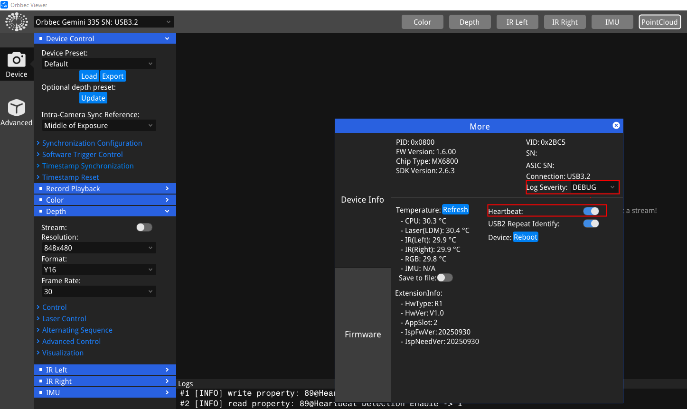
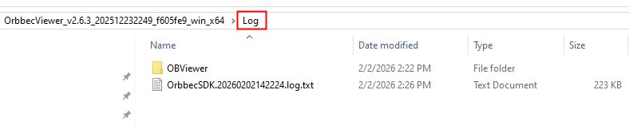
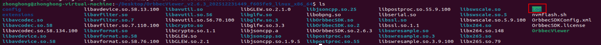
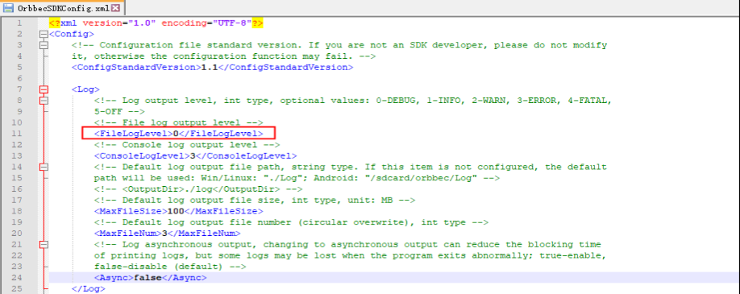
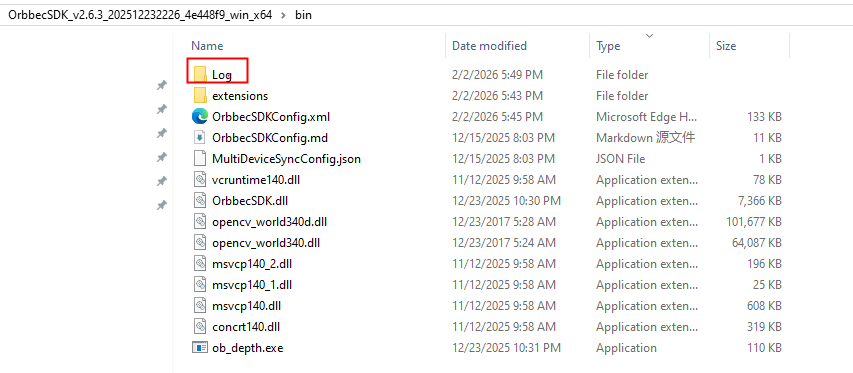
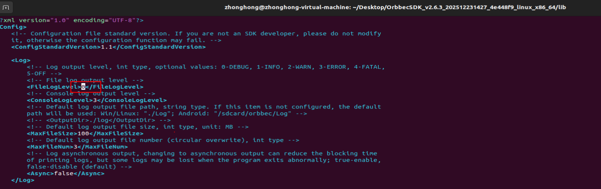
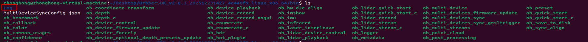

# How to save Orbbec SDK v2 log

This guide explains how to save logs from OrbbecViewer and Orbbec SDK v2 applications on both Windows and Linux.

## How to save logs using OrbbecViewer
First, set the log level to Debug. To enable device firmware logs,check the Heartbeat option.




Logs are saved in the Log folder located in the same directory as OrbbecViewer.
- Note: If the SDK is installed via the installer, the logs are saved in the Log directory alongside OrbbecViewer in the installation path.

### windows

On Windows, the log path is as follows:




### Linux (x64/ARM64)
On Linux (x64/ARM64), the log path is as follows:



## How to save logs in an Orbbec SDK v2 application

### windows
- Copy OrbbecSDKConfig.xml to the same directory as OrbbecSDK.dll.
- Set File Log level to 0 (Debug).



- To enable firmware logging, set DefaultHeartBeat to 1 in the corresponding device section. Example for Gemini 335Le:
```
    <Gemini335Le>
        <!-- Whether to enable heartbeat by default -->
            <DefaultHeartBeat>1</DefaultHeartBeat>
    </Gemini335Le>
``` 
- Logs are stored in the Log folder alongside the application. For example:




### Linux (x64/ARM64)
- Copy OrbbecSDKConfig.xml to the same directory as libOrbbecSDK.so.
- Set File Log level to 0 (Debug).


- Enable firmware logging by setting DefaultHeartBeat to 1 in the device section. Example for Gemini 335Le:
```
    <Gemini335Le>
        <!-- Whether to enable heartbeat by default -->
            <DefaultHeartBeat>1</DefaultHeartBeat>
    </Gemini335Le>
``` 
- Logs are stored in the Log folder alongside the application. For example:



# How to increase the usbfs memory limit

Linux Computer: USB Buffer Configuration on Ubuntu: By default, Linux-based hosts allocate only 16 MB of kernel memory for USB controller operations. This allocation may be insufficient for handling high-resolution images or multiple streams and devices. To support multiple devices, the USB controller requires more memory. Follow these steps to increase the memory allocation:
```
echo 128 | sudo tee /sys/module/usbcore/parameters/usbfs_memory_mb
```

For making this change permanent:
- Open `/etc/default/grub` file,Find and replace
```
GRUB_CMDLINE_LINUX_DEFAULT="quiet splash"
```

with this
```
GRUB_CMDLINE_LINUX_DEFAULT="quiet splash usbcore.usbfs_memory_mb=128"
```

- Update grub
```
sudo update-grub
```

- Reboot and check

```
cat /sys/module/usbcore/parameters/usbfs_memory_mb
```


